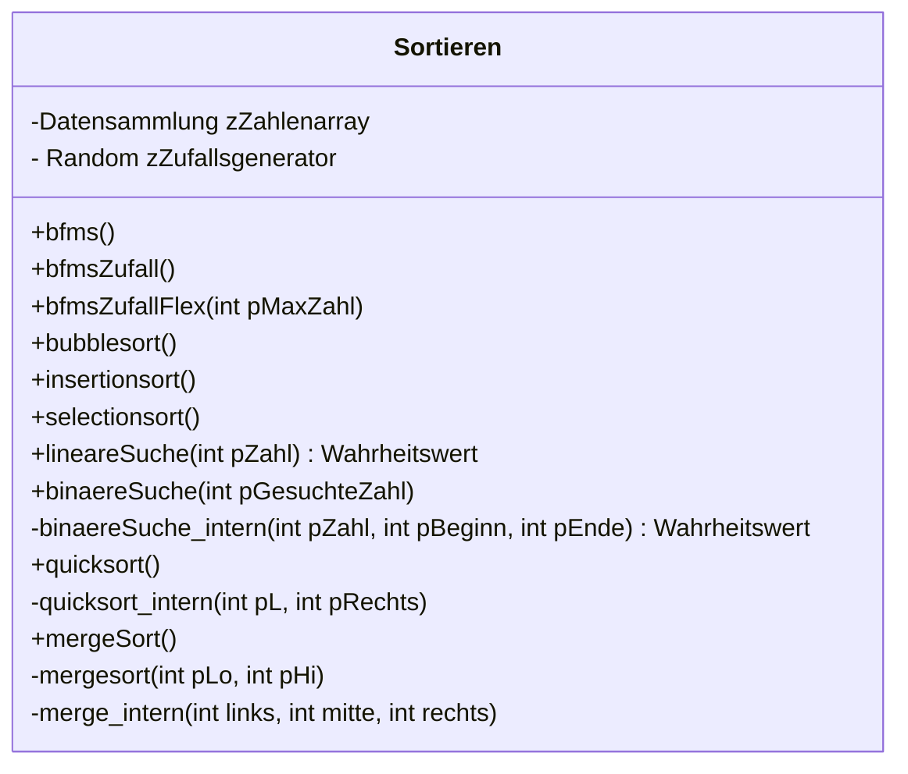
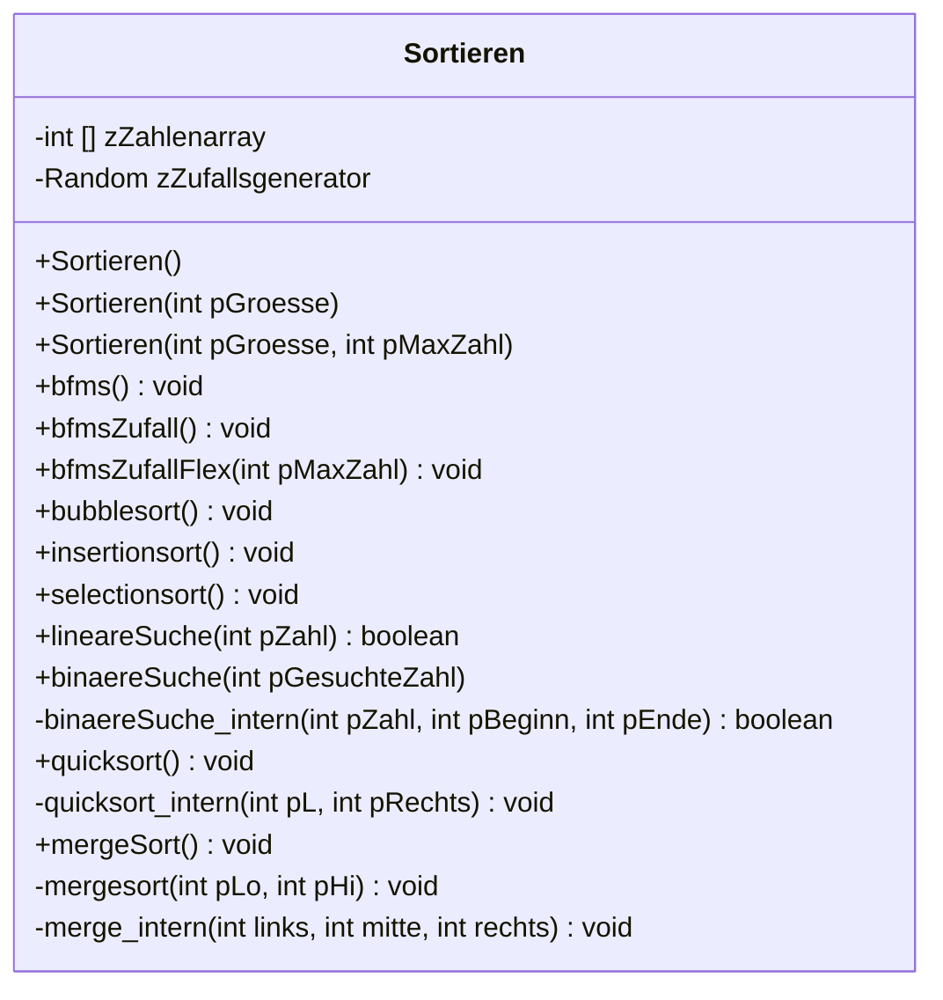

# Suchen und Sortieren auf der linearen Datenstruktur Array
Im Rahmen dieser Einheiten beschäftigen wir uns mit dem Suchen und Sortieren von Objekten. Der Einfachheit halber werden wir uns am Anfang auf das Sortieren von Zahlen beschränken, wobei jedes Objekt sortiert bzw. gesucht werden kann, wenn ein Suchkriterium vorliegt. In unserem Fall arbeiten wir auf der Datenstruktur Array :t[Arrays]{#array.md}
## UML Diagramm zum Projekt
Das unten stehende UML Diagramm dient als Vorlage. Das dargestellte Diagramm ist ein Implementaionsdiagram, da programmiersprachenspezifische Elemente (hier Java) enthalten sind.

Ein Entwurfsdiagramm ist programmiersprachenunabhängig und kann als Vorlage für unterschiedlichte Programmiersprachen genutzt werden.
Da Konstruktoren, get- und set-Methoden pragrammiersprachenspezifisch sind werden diese nicht mit dargestellt.

### Entwurfsdiagramm

### Implementationsdiagramm


### Aufgabe(n) zur Lösung mit edugit
0. Bearbeite die Aufgaben unter "Arbeiten mit BlueJ und edugit".
1. Erstelle eine Arbeitskopie des Projekts. Eine Arbeitskopie kannst du unter https://edugit.org/abitur-2024/01-suchen-und-sortieren-abi-2024.git mit BlueJ auschecken. 
2. Kopiere die Vorlagenklasse unter deinem Namen z.B.: Sortieren_Ulf in dasselbe Projekt.
3. Implementiere zuerst die Methoden, die **kein** Sortier- oder Suchalgorithmus sind. Was die einzelnen Methoden leisten sollen, steht in den Methodenkommentaren!
4. Teste deine Implementationen, indem du die erzeugten Objekte inspiziert. Ist das Array immer den Anforderungen entsprechend gefüllt?
5. Commitet, pusht und aktualisiere deine Implementation. 
6. Fertigt mit dem Struktogrameditor der Uni Dresden Struktogramme zu den einfachen Sortieralgorithmen: Bubble-, Insertion- und Selectionsort an und speichere sowohl eine Bilddatei als auch eine .json Datei deines Struktograms.
7. Nutze den Quellcodeexport und **teste** deine Exporte in **deiner** Klasse. Sollte etwas nicht funktionieren, verbessere es und passe auch deine Struktogramme dementsprechend an.
8. Commitet, pusht und aktualisiere deine Implementation. 
9. Fahre nach demselben Vorgehen (6-8) mit den beiden Suchmethoden (lineare Suche und binäre Suche) fort. Hilfestellungen findest du wieder in den Methodendokumentationen.
10. Fahre nach demselben Vorgehen (6-8) mit den beiden rekursiven Sortiermethoden (Quicksort und Mergesort) fort. Hilfestellungen findest du wieder in den Methodendokumentationen.
11. Beginne zum Beginn einer Stunde mit einer frischen Arbeitskopie deiner Implementation.

### Aufgabe(n) zur Lösung mit der online-IDE
1. Implementiere zuerst die Methoden, die **kein** Sortier- oder Suchalgorithmus sind. Was die einzelnen Methoden leisten sollen, steht in den Methodenkommentaren! Nutze hierfür die Vorlage in der Online-IDE. Hilfestellungen findest du im weiteren Kapitel. Informationen zur Klasse Mathe und den Umgagn mit dieser findest du hier https://www.learnj.de/doku.php?id=api:documentation:math:start und hier https://www.learnj.de/doku.php?id=einstieg:weiteredatentypen:start#die_klasse_math 
2. Teste deine Implementationen, indem du die erzeugten Objekte inspiziert. Ist das Array immer den Anforderungen entsprechend gefüllt?
3. Commitet, pusht und aktualisiere deine Implementation. 
4. Fertigt mit dem Struktogrameditor der Uni Dresden Struktogramme zu den einfachen Sortieralgorithmen: Bubble-, Insertion- und Selectionsort an und speichere sowohl eine Bilddatei als auch eine .json Datei deines Struktograms.
5. Nutze den Quellcodeexport und **teste** deine Exporte in **deiner** Klasse. Sollte etwas nicht funktionieren, verbessere es und passe auch deine Struktogramme dementsprechend an.
6. Commitet, pusht und aktualisiere deine Implementation. 
7. Fahre nach demselben Vorgehen (6-8) mit den beiden Suchmethoden (lineare Suche und binäre Suche) fort. Hilfestellungen findest du wieder in den Methodendokumentationen.
8. Fahre nach demselben Vorgehen (6-8) mit den beiden rekursiven Sortiermethoden (Quicksort und Mergesort) fort. Hilfestellungen findest du wieder in den Methodendokumentationen.
9. Beginne zum Beginn einer Stunde mit einer frischen Arbeitskopie deiner Implementation.

:::onlineide{height=500 console=false url="https://nrw.onlineide.openpatch.org/"}
```java 
Sortieren hase = new Sortieren();

/**
 * Mit Hilfe von Objekten der Klasse Sortierer koennen Zahlenwerte, die in einem Array gespeichert sind,
 * der groesse nach von klein nach groß sortiert werden.
 * Hierfuer stehen drei unterschiedliche Verfahren zur Verfuegung: Bubblesort, Selectionsort und Insertionsort
 * Fuer die Erzeugung von Zufallszahlen steht die Klasse Random zur Verfügung.
 * 
 * @author Sebastian Horn
 * @version 0.3
 */

public class Sortieren
{            
    
    //Deklaration der globalen Variablen/Zustandvariablen
    private int zZahlenarray[];
            
    //Methoden/ Eigenschaften von Objekten der klasse Sortieren 
    
    /**
     * Konstruktor der Klasse Sortieren. Im Konstruktor werden die zuvor deklarieten Zustandsvariablen
     * erzeugt. Nach dem Aufruf des Konstruktors ist ein Objekt der Klasse Sortieren erzeugt worden. Ein Array 
     * mit dem Namen zZahlenarray und der Grösse 30 wurde erzeugt. 
     * Es kann mehrer Konstruktoren geben, diese unterscheiden sich in den/ dem Parameter(n).
     */
    public Sortieren()
    {  
        //Zustandvariablen werden initialisiert
        zZahlenarray = new int [30]; 
    }
    
    /**
     * 2. Konstruktor der Klasse Sortieren. Im Konstruktor werden die zuvor deklarieten Zustandsvariablen
     * erzeugt. Nach dem Aufruf des Konstruktors ist ein Objekt der Klasse Sortieren erzeugt worden. Ein Array 
     * mit dem Namen zZahlenarray und einer variablen Groesse wurde erzeugt. 
     * Es kann mehrer Konstruktoren geben, diese unterscheiden sich in den/ dem Parameter(n).
     */
    public Sortieren(int pGroesse)
    {  
        //Zustandvariablen werden initialisiert
        zZahlenarray = new int [pGroesse];
    }
    
    /**
     * 3. Konstruktor der Klasse Sortieren. Im Konstruktor werden die zuvor deklarieten Zustandsvariablen
     * erzeugt. Nach dem Aufruf des Konstruktors ist ein Objekt der Klasse Sortieren erzeugt worden. Ein Array 
     * mit dem Namen zZahlenarray und einer variablen Groesse wurde erzeugt. Das Array mit Zufallszahlen ist im Zahlenspektrum von 0 - 
     * pMaxZahl befuellt. Nutze hierfür randint Methode der Klasse Random, die mit Hilfe von Random.randint(untereGrenze, obereGrenze) aufgerufen werden kann. Hilfe 
     * findest du unter https://www.learnj.de/doku.php?id=einstieg:weiteredatentypen:start#die_klasse_math
     * Es kann mehrer Konstruktoren geben, diese unterscheiden sich in den/ dem Parameter(n).
     * 
     * @param int pGroesse gibt die Groesse des Arrays an
     * @param int pMaxZahl gibt die groesste moegliche zu erzeugenden Zufallszahl an
     */
    public Sortieren(int pGroesse, int pMaxZahl)
    {  
        //Zustandvariablen werden initialisiert
        //Dein Quellcode hier
    }
    
    /**
     * Methode bfmsZufall
     * Auftrag: Nach dem Aufruf dieser Methode ist das Array zZahlenarray mit zufälligen Zahlen im Spektrum 
     * von 0 - 1000 befüllt
     */
    public void bfmsZufall()
    {         
        //Hilfe siehe 3. Konstruktor
        
    }
    
    /**
     * Methode bfmsZufallflex
     * Auftrag: Nach dem Aufruf dieser Methode ist das Array zZahlenarray mit zufälligen Zahlen im Spektrum 
     * von 0 - pMaxZahl befüllt.
     */
    public void bfmsZufallflex(int pMaxZahl)
    {
       // Dein Quellcode hier
    }


    /**
     * Method bfms
     * Auftrag: Nach dem Aufruf der Methode ist das Array zZahlenarray mit aufsteigenden Zahlenwerten 
     * beginnend bei 1 und einer Schrittweite von 1 gefuellt.
     *
     */
    public void bfms()
    { 
        for(int i = 0; i < 30; i++)
        {
            zZahlenarray[i]= i +1;
        }
    }
    
    
    /**
     * Method bubblesort
     * Auftrag: Nach Aufruf der Methode ist das Array zZahlenarray nach dem Prinzip Bubblesort sortiert worden.
     * 
     * Eine ausführliche Beschreibung muss hier eurerseits erfolgen!!!!!! Hilfe zum Prinzip findest du unter:
     * https://www.youtube.com/watch?v=lyZQPjUT5B4 und im Buch!!!!!
     * 
     * Hierfür muss das Array vorher mit Zahlenwerten gefüllt worden sein d.h. eine der Methoden zum Befüllen des Arrays
     * muss aufgerufen worden sein.
     * Wenn nicht bricht BlueJ mit einer Fehlermedung ab.
     */
    public void bubblesort()
    {   
       //Dein Quellcode
    }
    
    /**
     * Method insertionsort
     * Auftrag: Nach Aufruf der Methode ist das Array zZahlenarray nach dem Prinzip Insertionsort sortiert worden.
     * 
     * Eine ausführliche Beschreibung muss hier eurerseits erfolgen!!!!!!!!!Hilfe findest du hier:
     * https://www.youtube.com/watch?v=ROalU379l3U und im Buch.
     * 
     * Hierfür muss das Array vorher mit Zahlenwerten gefüllt worden sein d.h. eine der Methoden zum Befüllen des Arrays
     * muss aufgerufen worden sein.
     * Wenn nicht bricht BlueJ mit einer Fehlermedung ab.
     */
    public void insertionsort()
    {   
        //Tipp: i = 1
        for (int i=1; i<=zZahlenarray.length-1; i++)
        {   
            
        }    
    }
    
    /**
     * Method selectionsort
     * Auftrag: Nach Aufruf der Methode ist das Array zZahlenarray nach dem Prinzip Insertionsort sortiert worden.
     * 
     * Eine ausführliche Beschreibung muss hier eurerseits erfolgen!!!!!!!!! Hilfe findest du hier:
     * https://www.youtube.com/watch?v=Ns4TPTC8whw und im Buch!!!
     * 
     * Hierfür muss das Array vorher mit Zahlenwerten gefüllt worden sein d.h. eine der Methoden zum Befüllen des Arrays
     * muss aufgerufen worden sein.
     * Wenn nicht bricht BlueJ mit einer Fehlermedung ab.
     */
    public void selectionSort()
    {
        //Tipp: Auch hier werden 2 Schleifen benötigt
    }    
    
    
    /**
     * Methode lineareSuche
     *
     * @param pZahl Angabe der zu suchenden zahl
     * @return true wenn die Zahl gefunden wurde, sonst false
     */
    public boolean lineareSuche(int pZahl)
    {      
       //
       return false;
    } 
    
    /**
     * Initiale Sortiermethode fuer den Quicksort-Algorithmus
     */
    public void quickSort()
    {
        System.out.println("--------------------------------------------------------------------");
        System.out.println("Beginne neuen Sortiervorgang mit Quicksort");
        //zeigeElementenfolge();
        quicksort_intern(0, zZahlenarray.length-1);        
        //zeigeElementenfolge();
        //System.out.println("--------------------------------------------------------------------");        
    } 
    
    private void quicksort_intern(int pL, int pR)
    {
        int hLinks = pL;  // Hilfszeiger f¸r links
        int hRechts = pR; // Hilfszeiger f¸r rechts
        int hPivot = (int) (Math.random()*(pR-pL+1))+pL; // Stelle des Pivot
        //dein Quellcode hier
    }
    
    /**
    * Analysiere die Methode
    */
    public void mergeSort()
    {
       mergesort(0, zZahlenarray.length-1); 
    }
    
    private void mergesort(int pLo, int pHi)
    {
        int hMitte = (pLo + pHi)/2;
        if (pHi > pLo)
        {
            mergesort(pLo, hMitte);
            mergesort(hMitte+1, pHi);
            merge_intern(pLo, hMitte, pHi);
        }
    }
    
    private void merge_intern(int links, int mitte, int rechts)
    {
        int i,j,k;
        i = 0;
        j = links;
        int []b = new int [mitte - links +1];
        while (j <= mitte)
        {
            b[i] = zZahlenarray[j];
            i++;
            j++;
        }
        i = 0;
        k= links;
        while(k<j && j>= rechts)
        {
            if(b[i] <=zZahlenarray[j])
            {
                zZahlenarray[k] = b[i];
                k++;
                i++;
            }
            else
            {
                zZahlenarray[k] = zZahlenarray[j];
                k++;
                j++;
            }
        }
        while(k<j)
        {
            zZahlenarray[k] = b[i];
            k++;
            i++;
        }
    }
    
    public boolean binaereSuche(int pGesuchteZahl)
    {
        boolean gefunden = binaereSuche_intern(pGesuchteZahl,0, zZahlenarray.length -1);
        return gefunden;        
    }
    
    private boolean binaereSuche_intern(int pZahl, int pBeginn, int pEnde)
    {
        //Dein Quellcode hier
      return true;  
    }
}
```
:::

# Einfache Sortieralgorithmen
## Bubblesort und optimierter Bubblesort
### Video
::youtube[Bubblesort]{#lyZQPjUT5B4}
### Erklärung
### Beispiel Anwendung:
| [0] | [1] | [2] | [3] | [4] | [5] | [6] | [7] | [8] | [9] | ges. Zahl |
| :-: | :-: | :-: | :-: | :-: | :-: | :-: | :-: |:-:| :-: | :-: |
| **16** | **78** | 11 | 9 | 0 | 777 | 45 | 109 | 8 | 90 | 11 |

### Struktogramm und Java Quellcode
::::tabs{id="Bubblesort"}
:::tab{title="Struktogramm Bubblesort" id="Struktogramm Bubblesort"}


Du kannst dir das Struktorgramm auch als json Datei herunterladen. Dieses kann dann im Struktogramm Editor der  [Uni Dresden](https://dditools.inf.tu-dresden.de/ovk/Informatik/Programmierung/Grundlagen/Struktogramme.html) eingebunden und weiterverwendet werden
:download[Herunterladen]{src="/download/Bubblesort_Struktogramm.json"}
:::
:::tab{title="Java Bubblesort" id="Java Bubblesort"}
```java
   public void bubblesort()
    {   
        int hilfe = 0;
        for (int i = 0; i < zZahlenarray.length; i++)
        {
            for (int x = 0; x < zZahlenarray.length -1; x++)
            {
                if (zZahlenarray [x] > zZahlenarray [+1])
                {
                    hilfe= zZahlenarray[x+1];
                    zZahlenarray [x] = zZahlenarray[x+1];
                    zZahlenarray [x] = hilfe;
                }
            }
        }
    }
```
:::
::::

## Insertionsort
### Video
::youtube[Insertionsort]{#ROalU379l3U}
### Erklärung
Der Insertion Sort ist ein stabiler Sortieralgorhitmus. Übersetzen lässt sich Insertion Sort mit den englischen Wörtern Insertion = Einfügen und Sort = Sortieren, so mit herrscht Sortieren durch Einfügen. Es gibt einen sortierten- und unsortierten Bereich in Insertion Sort. Die erste Zahl (im Array Fach 0) gehört von Anfang an zum sortierten Bereich, daraufhin wird die nächste Zahl im unsortierten Bereich mit den Zahlen im sortierten Bereich verglichen und an die richtige Position gebracht. Dies bedeutet das der Algorhithmus in-place (weiterer Speicherplatz wird außerhalb des Arrays **nicht** benötigt) arbeitet.
### Beispiel Anwendung:
| [0] | [1] | [2] | [3] | [4] | [5] |
| :-: | :-: | :-: | :-: | :-: | :-: | 
| **16** | 78 | 11 | 9 | 0 | 777 |
| **16** | **78** | 11 | 9 | 0 | 777 |
| 16 | **78** | **11** | 9 | 0 | 777 |
| **16** | **11** | 78 | 9 | 0 | 777 |
| 11 | 16 | **78** | **9** | 0 | 777 |
| 11 | **16** | **9** | 78 | 0 | 777 |
| **11** | **9** | 16 | 78 | 0 | 777 |
| 9 | 11 | 16 | **78** | **0** | 777 |
| 9 | 11 | **16** | **0** | 78 | 777 |
| 9 | **11** | **0** | 16 | 78 | 777 |
| **9** | **0** | 11 | 16 | 78 | 777 |
| 0 | 9 | 11 | 16 | **78** | **777** |
| _0_ | _9_ | _11_ | _16_ | _78_ | _777_ |


### Struktorgramm und Java Quellcode
::::tabs{id="Insertionsort"}
:::tab{title="Struktogramm Insertionsort" id="Struktogramm Insertionsort"}


Du kannst dir das Struktorgramm auch als json Datei herunterladen. Dieses kann dann im Struktogramm Editor der  [Uni Dresden](https://dditools.inf.tu-dresden.de/ovk/Informatik/Programmierung/Grundlagen/Struktogramme.html) eingebunden und weiterverwendet werden
:download[Herunterladen]{src="/download/Insertionsort_Struktogramm.json"}
:::
:::tab{title="Java Insertionsort" id="Java Insertionsort"}
```java
    public void insertionsort()
    {
        int hilfe = 0;
        for (int i = 0;i<zZahlenarray.length; i++)
        {
            if (zZahlenarray [i] > zZahlenarray [i+1])
            {
                hilfe = zZahlenarray[i];;
                zZahlenarray[i] = zZahlenarray[i+1];;
                zZahlenarray[i+1]= hilfe;;
                for (int j = i;j>0;j--)
                {
                    if (zZahlenarray [i] < zZahlenarray [i-1])
                    {
                        hilfe = zZahlenarray[i];;
                        zZahlenarray[i] = zZahlenarray[i-1];
                        zZahlenarray[i-1]= hilfe;;
                    }
                }
            }
        }
    }
```
:::
:::tab{title="Struktogramm Insertionsort optimiert" id="Struktogramm Insertionsort optimiert"}


Du kannst dir das Struktorgramm auch als json Datei herunterladen. Dieses kann dann im Struktogramm Editor der  [Uni Dresden](https://dditools.inf.tu-dresden.de/ovk/Informatik/Programmierung/Grundlagen/Struktogramme.html) eingebunden und weiterverwendet werden
:download[Herunterladen]{src="/download/Insertionsort_Struktogramm_optimiert.json"}
:::
:::tab{title="Java Insertionsort optimiert" id="Java Insertionsort optimiert"}
```java
    public void insertionsort()
    {
    for (int i = 1; i < zZahlenarray.length; i++)
        {
            int kleinereZahl = zZahlenarray[i];
            int j = i;
            while (j >0 && kleinereZahl < zZahlenarray[j-1])
            {
                zZahlenarray[j] = zZahlenarray[j - 1];;
                j--;
            }
        zZahlenarray[j] = kleinereZahl;;
        }
    }
```
:::
::::
## Selectionsort
### Video
::youtube[Selectionsort]{#Ns4TPTC8whw}
### Erklärung
### Beispiel Anwendung:
| [0] | [1] | [2] | [3] | [4] | [5] | [6] | [7] | [8] | [9] | ges. Zahl |
| :-: | :-: | :-: | :-: | :-: | :-: | :-: | :-: |:-:| :-: | :-: |
| **16** | 78 | 11 | 9 | 0 | 777 | 45 | 109 | 8 | 90 | **11** |
### Struktorgramm und Java Quellcode
::::tabs{id="Selectionsort"}
:::tab{title="Selectionsort" id="Struktog. Selectionsort"}
:::
:::tab{title="Java Selectionsort" id="Java Selectionsort"}
```java
    
```
:::
:::tab{title="Selectionsort optimiert" id="Struktog. Selectionsort optimiert"}
:::
:::tab{title="Java Selectionsort optimiert" id="Java Selectionsort optimiert"}
```java
    
```
:::
::::

# Rekursive Sortieralgorithmen

## Mergesort
### Video
::youtube[Mergesort]{#XaqR3G_NVoo}
### Erklärung
### Beispiel Anwendung:
| [0] | [1] | [2] | [3] | [4] | [5] | [6] | [7] | [8] | [9] | ges. Zahl |
| :-: | :-: | :-: | :-: | :-: | :-: | :-: | :-: |:-:| :-: | :-: |
| **16** | 78 | 11 | 9 | 0 | 777 | 45 | 109 | 8 | 90 | **11** |
### Struktorgramm und Java Quellcode
::::tabs{id="Mergesort"}
:::tab{title="Mergesort" id="Struktog. Mergesort"}
:::
:::tab{title="Java Mergesort" id="Java Mergesort"}
```java
    
```
:::
:::tab{title="Mergesort optimiert" id="Struktog. Mergesort optimiert"}
:::
:::tab{title="Java Mergesort optimiert" id="Java Mergesort optimiert"}
```java
    
```
:::
::::

## Quicksort
### Video
::youtube[Quicksort]{#ywWBy6J5gz8}
### Erklärung
Das Array wird um ein frei zu wählendes Pivotelement sortiert. Anschließend wird dasselbe Prinzip auf die kleineren "Teilarrays" angewand, bis das Problem trivial ist, also nuur noch ein Elemnt sortiert werden muss.
### Beispiel Anwendung
### Aufruf Gesamtarray
| [0] | [1] | [2] | [3] | [4] | [5] | [6] | [7] | [8] | [9] |
| :-: | :-: | :-: | :-: | :-: | :-: | :-: | :-: |:-:  | :-: |
| 16  | 78  | 11  | 0   | 9   | 777 | 45  | 109 | 8   | 90  |
|  L  |     |     |     |P    |     |     |     |     |  R  |
| 16  | 78  | 11  | 0   | 9   | 777 | 45  | 109 | 8   | 90  |
|  L  |     |     |     | P   |     |     |     |  R  |     |
| 8   | 78  | 11  | 0   | 9   | 777 | 45  | 109 | 16  | 90  |
|     |  L  |     |     | P   |     |     |     |   R |     |
| 8   | 78  | 11  | 0   | 9   | 777 | 45  | 109 | 16  | 90  |
|     |  L  |     |     | P   |     |     | R   |     |     |
| 8   | 78  | 11  | 0   | 9   | 777 | 45  | 109 | 16  | 90  |
|     |  L  |     |     | P   |     |  R  |     |     |     |
| 8   | 78  | 11  | 0   | 9   | 777 | 45  | 109 | 16  | 90  |
|     |  L  |     |     | P   |   R |     |     |     |     |
| 8   | 78  | 11  | 0   | 9   | 777 | 45  | 109 | 16  | 90  |
|     |  L  |     |     | P R |     |     |     |     |     |
| 8   |  9  | 11  | 0   | 78  | 777 | 45  | 109 | 16  | 90  |
|     |  L P|     |     |  R  |     |     |     |     |     |
| 8   |  9  | 11  | 0   | 78  | 777 | 45  | 109 | 16  | 90  |
|     |  L P|     |  R  |     |     |     |     |     |     |
| 8   |  0  | 11  | 9   | 78  | 777 | 45  | 109 | 16  | 90  |
|     |  L  |     |  P R|     |     |     |     |     |     |
| 8   |  0  | 11  | 9   | 78  | 777 | 45  | 109 | 16  | 90  |
|     |     |  L  |  P R|     |     |     |     |     |     |
| 8   |  0  | 9   | 11  | 78  | 777 | 45  | 109 | 16  | 90  |
|     |     | L P |    R|     |     |     |     |     |     |
| 8   |  0  | 9   | 11  | 78  | 777 | 45  | 109 | 16  | 90  |
|     |     |L P  |     |     |     |     |     |     |     |


### Teilung und rekursiver Aufruf
| [0] | [1] |    |[2] |    |[3] | [4] | [5] | [6] | [7] | [8] | [9] |
| :-: | :-: |:-: |:-: |:-: |:-: | :-: | :-: | :-: | :-: |:-:  | :-: |
| 8   |  0  |    |9   |    |11  | 78  | 777 | 45  | 109 | 16  | 90  |
| L   | P R |    |    |    |    |     |     |     |     |     |     |


### Tauschen
| [0] | [1] |    |[2] |    |[3] | [4] | [5] | [6] | [7] | [8] | [9] |
| :-: | :-: |:-: |:-: |:-: |:-: | :-: | :-: | :-: | :-: |:-:  | :-: |
| 0   |  8  |    |9   |    |11  | 78  | 777 | 45  | 109 | 16  | 90  |
| L P |   R |    |    |    |    |     |     |     |     |     |     |
| 0   |  8  |    |9   |    |11  | 78  | 777 | 45  | 109 | 16  | 90  |
| L P R|    |    |    |    |    |     |     |     |     |     |     |


### Teilung
| [0] |   | [1] |    |[2] |    |[3]  | [4] | [5] | [6] | [7] | [8] | [9] |
| :-: |:-:| :-: | :-:|:-: |:-: | :-: | :-: | :-: | :-: | :-: |:-:  | :-: |
| 0   |   |   8 |    | 9  |    | 11  | 78  | 777 | 45  | 109 | 16  | 90  |
|L P R|   |     |    |    |    |     |     |     |     |     |     |     |


### Rekursiver Aufruf
| [0] |   | [1] |    |[2] |    |[3]  | [4] | [5] | [6] | [7] | [8] | [9] |
| :-: |:-:| :-: | :-:|:-: |:-: | :-: | :-: | :-: | :-: | :-: |:-:  | :-: |
| 0   |   |   8 |    | 9  |    | 11  | 78  | 777 | 45  | 109 | 16  | 90  |
|     |   |     |    |    |    |  L  |     |     | P   |     |     |  R  |
| 0   |   |   8 |    | 9  |    | 11  | 78  | 777 | 45  | 109 | 16  | 90  |
|     |   |     |    |    |    |     | L   |     | P   |     |     |  R  |
| 0   |   |   8 |    | 9  |    | 11  | 78  | 777 | 45  | 109 | 16  | 90  |
|     |   |     |    |    |    |     | L   |     | P   |     |  R  |     |
| 0   |   |   8 |    | 9  |    | 11  | 16  | 777 | 45  | 109 | 78  | 90  |
|     |   |     |    |    |    |     | L   |     | P   |     |  R  |     |
| 0   |   |   8 |    | 9  |    | 11  | 16  | 777 | 45  | 109 | 78  | 90  |
|     |   |     |    |    |    |     |     |  L  | P   |     |  R  |     |
| 0   |   |   8 |    | 9  |    | 11  | 16  | 777 | 45  | 109 | 78  | 90  |
|     |   |     |    |    |    |     |     |  L  | P   |  R  |     |     |
| 0   |   |   8 |    | 9  |    | 11  | 16  | 777 | 45  | 109 | 78  | 90  |
|     |   |     |    |    |    |     |     |  L  | P R |     |     |     |
| 0   |   |   8 |    | 9  |    | 11  | 16  | 45  | 777 | 109 | 78  | 90  |
|     |   |     |    |    |    |     |     | L P |   R |     |     |     |


### Teilung und rekursiver Aufruf
| [0] |   | [1] |    |[2] |    |[3]  | [4] |    |[5] | [6] | [7] | [8] | [9] |
| :-: |:-:| :-: | :-:|:-: |:-: | :-: | :-: |:-: |:-: | :-: | :-: |:-:  | :-: |
| 0   |   |   8 |    | 9  |    | 11  | 16  |    |45  | 777 | 109 | 78  | 90  |
|     |   |     |    |    |    |  L  | P R |    |    |     |     |     |     |
| 0   |   |   8 |    | 9  |    | 11  | 16  |    |45  | 777 | 109 | 78  | 90  |
|     |   |     |    |    |    |L P R|     |    |    |     |     |     |     |


### Teilung
| [0] |   | [1] |    |[2] |    |[3]  |    |[4] |    |[5] | [6] | [7] | [8] | [9] |
| :-: |:-:| :-: | :-:|:-: |:-: | :-: | :-:|:-: |:-: |:-: | :-: | :-: |:-:  | :-: |
| 0   |   |   8 |    | 9  |    | 11  |    | 16 |    | 45 | 777 | 109 | 78  | 90  |
|     |   |     |    |    |    |L P R|    |    |    |    |     |     |     |     |


### Rekursiver Aufruf
| [0] |   | [1] |    |[2] |    |[3]  |    |[4] |    |[5] | [6] | [7] | [8] | [9] |
| :-: |:-:| :-: | :-:|:-: |:-: | :-: | :-:|:-: |:-: |:-: | :-: | :-: |:-:  | :-: |
| 0   |   |   8 |    | 9  |    | 11  |    | 16 |    | 45 | 777 | 109 | 78  | 90  |
|     |   |     |    |    |    |     |    |    |    | L  |     |  P  |     |  R  |

| [0] |   | [1] |    |[2] |    |[3]  |    |[4] |    |[5] | [6] | [7] | [8] | [9] |
| :-: |:-:| :-: | :-:|:-: |:-: | :-: | :-:|:-: |:-: |:-: | :-: | :-: |:-:  | :-: |
| 0   |   |   8 |    | 9  |    | 11  |    | 16 |    | 45 | 777 | 109 | 78  | 90  |
|     |   |     |    |    |    |     |    |    |    |    |  L  |  P  |     |  R  |
| 0   |   |   8 |    | 9  |    | 11  |    | 16 |    | 45 | 777 | 109 | 78  | 90  |
|     |   |     |    |    |    |     |    |    |    |    |  L  |  P  |  R  |     |
| 0   |   |   8 |    | 9  |    | 11  |    | 16 |    | 45 | 777 | 109 | 78  | 90  |
|     |   |     |    |    |    |     |    |    |    |    |  L  | P R |     |     |
| 0   |   |   8 |    | 9  |    | 11  |    | 16 |    | 45 | 109 | 777 | 78  | 90  |
|     |   |     |    |    |    |     |    |    |    |    | L P |  R  |     |     |
| 0   |   |   8 |    | 9  |    | 11  |    | 16 |    | 45 | 109 | 777 | 78  | 90  |
|     |   |     |    |    |    |     |    |    |    |    |L P R|     |     |     |


### Teilung und rekursiver Aufruf
| [0] |   | [1] |    |[2] |    |[3]  |    |[4] |    |[5] |   | [6] |    |[7] | [8] | [9] |
| :-: |:-:| :-: | :-:|:-: |:-: | :-: | :-:|:-: |:-: |:-: |:-:| :-: |:-: |:-: |:-:  | :-: |
| 0   |   |   8 |    | 9  |    | 11  |    | 16 |    | 45 |   |109  |    |777 | 78  | 90  |
|     |   |     |    |    |    |     |    |    |    |    |   |L P R|    |    |     |     |
| 0   |   |   8 |    | 9  |    | 11  |    | 16 |    | 45 |   |109  |    |777 | 78  | 90  |
|     |   |     |    |    |    |     |    |    |    |    |   |     |    |  L |  P  |  R  |
| 0   |   |   8 |    | 9  |    | 11  |    | 16 |    | 45 |   |109  |    |777 | 78  | 90  |
|     |   |     |    |    |    |     |    |    |    |    |   |     |    |  L | P R |     |
| 0   |   |   8 |    | 9  |    | 11  |    | 16 |    | 45 |   |109  |    |78  | 777 | 90  |
|     |   |     |    |    |    |     |    |    |    |    |   |     |    |L P |   R |     |
| 0   |   |   8 |    | 9  |    | 11  |    | 16 |    | 45 |   |109  |    |78  | 777 | 90  |
|     |   |     |    |    |    |     |    |    |    |    |   |     |    |L P R|    |     |


### Teilung und rekursiver Aufruf
| [0] |   | [1] |    |[2] |    |[3]  |    |[4] |    |[5] |   | [6] |    | [7] |   | [8] | [9] |
| :-: |:-:| :-: | :-:|:-: |:-: | :-: | :-:|:-: |:-: |:-: |:-:| :-: |:-: | :-: |:-:| :-: | :-: |
| 0   |   |   8 |    | 9  |    | 11  |    | 16 |    | 45 |   |109  |    | 78  |   | 777 | 90  |
|     |   |     |    |    |    |     |    |    |    |    |   |     |    |     |   |  L  | P R |
| 0   |   |   8 |    | 9  |    | 11  |    | 16 |    | 45 |   |109  |    | 78  |   | 90  | 777 |
|     |   |     |    |    |    |     |    |    |    |    |   |     |    |     |   | L P |  R  |
| 0   |   |   8 |    | 9  |    | 11  |    | 16 |    | 45 |   |109  |    | 78  |   | 90  | 777 |
|     |   |     |    |    |    |     |    |    |    |    |   |     |    |     |   |L P R|     |


### Fertig
| [0] |   | [1] |    |[2] |    |[3]  |    |[4] |    |[5] |   | [6] |    | [7] |   | [8] |    |[9] |
| :-: |:-:| :-: | :-:|:-: |:-: | :-: | :-:|:-: |:-: |:-: |:-:| :-: |:-: | :-: |:-:| :-: | :-:|:-: |
| 0   |   |   8 |    | 9  |    | 11  |    | 16 |    | 45 |   |109  |    | 78  |   | 90  |    |777 |
|     |   |     |    |    |    |     |    |    |    |    |   |     |    |     |   |     |    |L P R|

**Legende:** 

Links: L

Pivot: P

Rechts: R


### Struktorgramm und Java Quellcode
::::tabs{id="Quicksort Struktogr."}
:::tab{title="Quicksort" id="Struktog. Quicksort"}
:::
:::tab{title="Java Quicksort" id="Java Quicksort"}
```java
    public void quickSort()
    {
        System.out.println("--------------------------------------------------------------------");
        System.out.println("Beginne neuen Sortiervorgang mit Quicksort");
        quicksort_intern(0, zZahlenarray.length-1);        
    }     
```
:::
:::tab{title="Quicksort intern" id="Struktog. Quicksort intern"}
:::
:::tab{title="Java Quicksort intern" id="Java Quicksort intern"}
```java
    private void quicksort_intern(int pL, int pR)
    {
        int hLinks = pL;  // Hilfszeiger fÜr links
        int hRechts = pR; // Hilfszeiger fÜr rechts
        int hPivot = (int) (zZahlenarray[(pL+pR)/2]);// Stelle des Pivot
        while (hLinks <= hRechts) {
            while (zZahlenarray[hLinks] < hPivot) {
                hLinks++;
            }
            while (zZahlenarray[hRechts] > hPivot) {
                hRechts--;
            }
            if (hLinks <= hRechts) {
                int hilfe = zZahlenarray[hLinks];
                zZahlenarray[hLinks] = zZahlenarray[hRechts];
                zZahlenarray[hRechts] = hilfe;
                hLinks++;
                hRechts--;
            }
        }
        if (pL < hRechts){
            quicksort_intern(pL, hRechts);
        }
        if (hLinks < pR){
            quicksort_intern(pR, hLinks);
        }
    }   
```
:::
::::
# Aufwandsabschätzung

https://cryptpad.fr/sheet/#/2/sheet/view/xH9bfbaoI0-4Vb9TtHEUxhpMWZ-P63gabh4H6ZmrGy0/
