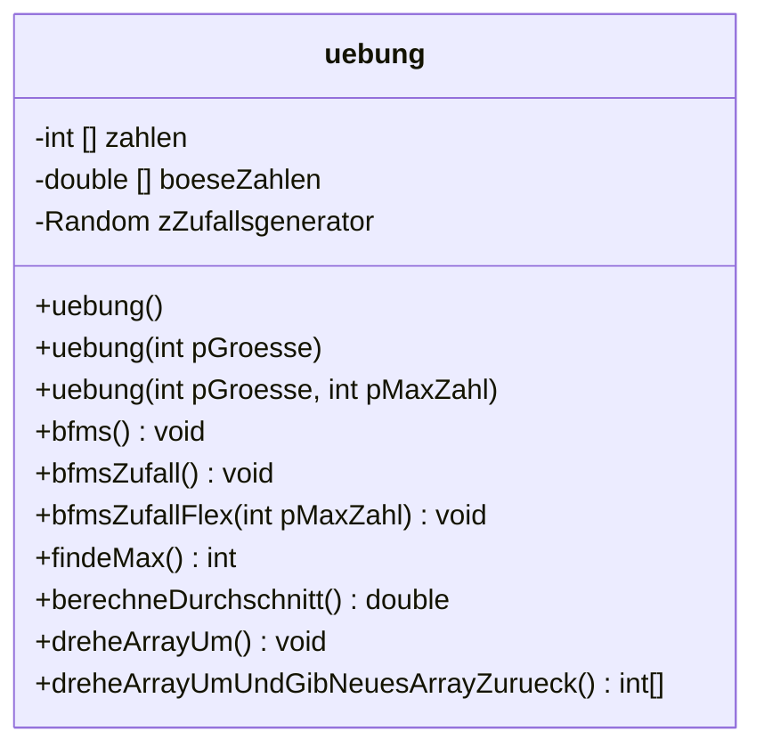

# Arrays oder Felder

Die folgenden Aufgaben beziehen sich auf das unten stehende Implementationsdiagramm.



:::alert{info}
## Aufgabe(n)
1. Informiere dich bitte im Glossar über:t[Arrays]{#array.md}
2. Bearbeite die Aufgaben, die in den Kommentaren der Klasse uebung stehen mit Hilfe der online-ide.
3. Sichere deine Ergebnisse z.B. in deinem Homeverzeichnis
4. Erstelle eigene Prompts mit deren Hilfe mindestens vier Übungsprogrammieraufgaben zum Thema Arrays in Java erstellt werden und halte diese als Methoden fest. Nutze hierfür die schulKI.
5. Teste die Ergebnisse in der Online-IDE und passe den Quellcode ggf. an. Vergiss nicht deinen Quelltext zu kommentieren.
6. Bereite deine Ergebenisse so vor, dass sie als Übungsaufgabe von den anderen mit Hilfe der Online-IDE getestet werden können.
:::

:::onlineide{height=500 console=false url="http://nrw.onlineide.openpatch.org/"}

```java 
uebung test = new uebung();
System.out.println("Das gesuchte Element ist: " + test.wasTueIch());
System.out.println("Der Durchschnitt des Arrays boeseZahlen lautet: " + test.berechneDurchschnitt());

ublic class uebung {
   private int [] zahlen = { 5, 8, 2, 6, 3 };
   private double [] boeseZahlen;
   private int [] schleifenArray;

   public uebung() {
      boeseZahlen = new double[10];
      boeseZahlen[0] = 2.3;
      boeseZahlen[1] = 5.7;
      boeseZahlen[2] = 12.4;
      boeseZahlen[3] = 0.9;
      boeseZahlen[4] = 87.1;
      boeseZahlen[5] = 2.0;
      boeseZahlen[6] = 2.5;
      boeseZahlen[7] = 4.3;
      boeseZahlen[8] = 6.89;
      boeseZahlen[9] = 0.56;
   }

   /*
    * Befüllt das Array von der Zahl 11 beginnend und gibt das Ergebnis
    * mit System.out.println auf der Konsole aus.
    */
   public void bfmS() {
      schleifenArray = new int[15]; 
      //Dein Quelltext hier
   }

   /*
    * Befüllt das Array mit der Größe pGroesse (Anzahl Felder) beginnend bei 2 und
    * nur geraden Zahlen. Das Ergebnis wird mit System.out.println auf der Konsole aus.
    */
   public void bfmS(int pGroesse) {
      //Dein Quelltext hier
   }

   /*
    * Analysiere die Methode, indem du die Rückgabe ermittelst und erläuterst
    * wie die Methode arbeitet.
    */
   public int wasTueIch() {
      int keineAhnung = zahlen[0];
      for (int i = 1; i < zahlen.length; i++) {
         if(zahlen[i] > keineAhnung) {
            keineAhnung = zahlen[i];
         }
      }
      return keineAhnung;
   }

   /*
    * Schreibe eine Methode mit dem Namen "berechneDurchschnitt", 
    * die den Durchschnitt aller Werte in diesem Array berechnet und zurückgibt.
    */
   public double berechneDurchschnitt() {
      double durchschnitt = 0.0;
      //Dein Quellcode hier
      return durchschnitt;
   }
   
   /*
    * Mit Hilfe der Methode werden die Werte des Arrays in umgekehrter
    * Reihenfolge auf der Konsole ausgegeben.
    */
   public void dreheArrayUm() {
      //Dein Quellcode hier!
   } 

   /*
    * Mit Hilfe der Methode werden die Werte des Arrays in umgekehrter
    * Reihenfolge in ein neues Array geschriben, welches zurückgegeben wird.
    * Die Werte werden zusätzlich auf der Konsole ausgegeben.
    */
   public int[] dreheArrayUmUndGibNeuesArrayZurueck() {
      int [] neuesArray = new int[zahlen.length];
      //Dein Quellcode hier
      return neuesArray;
   } 

}
```
:::