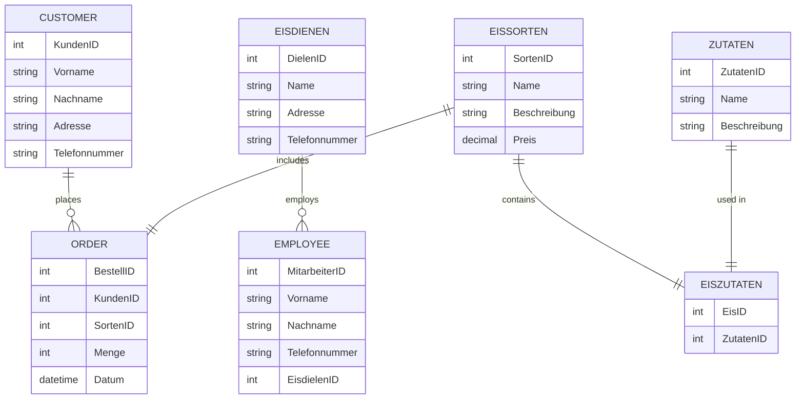

# Datenbanken mit Chat GPT
Die Eisverkauf Datenbank und Tutorial ist mit Hilfe von Chat GPT erstanden.

## Eisverkauf Datenbank

::::tabs

:::tab{title="Chat GPT Promt"}
```
Gib eine beispielhafte Datenbank sqllite an mit mindestens 7 Entitäten zum Themenbereich Eisverkauf an. Stelle die Datenbank als mermaid Diagramm dar und gib das Relationenschemata der Tabelle an. 
```
:::

:::tab{title="mysqlite DB"}
```sql
-- Tabelle "Kunden"
CREATE TABLE Kunden (
  KundenID INTEGER PRIMARY KEY,
  Vorname TEXT,
  Nachname TEXT,
  Adresse TEXT,
  Telefonnummer TEXT
);

-- Tabelle "Eisdielen"
CREATE TABLE Eisdielen (
  DielenID INTEGER PRIMARY KEY,
  Name TEXT,
  Adresse TEXT,
  Telefonnummer TEXT
);

-- Tabelle "Eissorten"
CREATE TABLE Eissorten (
  SortenID INTEGER PRIMARY KEY,
  Name TEXT,
  Beschreibung TEXT,
  Preis DECIMAL
);

-- Tabelle "Bestellungen"
CREATE TABLE Bestellungen (
  BestellID INTEGER PRIMARY KEY,
  KundenID INTEGER,
  SortenID INTEGER,
  Menge INTEGER,
  Datum DATETIME,
  FOREIGN KEY (KundenID) REFERENCES Kunden(KundenID),
  FOREIGN KEY (SortenID) REFERENCES Eissorten(SortenID)
);

-- Tabelle "Zutaten"
CREATE TABLE Zutaten (
  ZutatenID INTEGER PRIMARY KEY,
  Name TEXT,
  Beschreibung TEXT
);

-- Tabelle "Eiszutaten"
CREATE TABLE Eiszutaten (
  EisID INTEGER,
  ZutatenID INTEGER,
  PRIMARY KEY (EisID, ZutatenID),
  FOREIGN KEY (EisID) REFERENCES Eissorten(SortenID),
  FOREIGN KEY (ZutatenID) REFERENCES Zutaten(ZutatenID)
);

-- Tabelle "Mitarbeiter"
CREATE TABLE Mitarbeiter (
  MitarbeiterID INTEGER PRIMARY KEY,
  Vorname TEXT,
  Nachname TEXT,
  Telefonnummer TEXT,
  EisdielenID INTEGER,
  FOREIGN KEY (EisdielenID) REFERENCES Eisdielen(DielenID)
);
```
:::

:::tab{title="Relationenschemata"}
```sql
Kunden(KundenID, Vorname, Nachname, Adresse, Telefonnummer)
Eisdielen(DielenID, Name, Adresse, Telefonnummer)
Eissorten(SortenID, Name, Beschreibung, Preis)
Bestellungen(BestellID, KundenID, SortenID, Menge, Datum)
Zutaten(ZutatenID, Name, Beschreibung)
Eiszutaten(EisID, ZutatenID)
Mitarbeiter(MitarbeiterID, Vorname, Nachname, Telefonnummer, EisdielenID)
```
:::
:::tab{title="ER Diagramm"}

:::
::::


:::sqlide{height=500}

```mysql Statements.sql

SELECT * from fluss;

```

:::