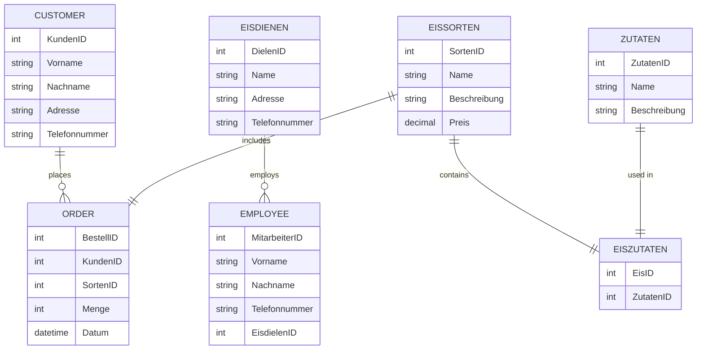

# Datenbanken mit Chat GPT
Die Eisverkauf Datenbank und Tutorial ist mit Hilfe von Chat GPT erstanden.

## Eisverkauf Datenbank

::::tabs

:::tab{title="Chat GPT Promt"}
Gib eine beispielhafte Datenbank sqllite an mit mindestens 7 Entitäten zum Themenbereich Eisverkauf an. Stelle die Datenbank als mermaid Diagramm dar und gib das Relationenschemata der Tabelle an. 
:::

:::tab{title="mysqlite DB"}
```sql
-- Tabelle "Kunden"
CREATE TABLE Kunden (
  KundenID INTEGER PRIMARY KEY,
  Vorname TEXT,
  Nachname TEXT,
  Adresse TEXT,
  Telefonnummer TEXT
);

-- Tabelle "Eisdielen"
CREATE TABLE Eisdielen (
  DielenID INTEGER PRIMARY KEY,
  Name TEXT,
  Adresse TEXT,
  Telefonnummer TEXT
);

-- Tabelle "Eissorten"
CREATE TABLE Eissorten (
  SortenID INTEGER PRIMARY KEY,
  Name TEXT,
  Beschreibung TEXT,
  Preis DECIMAL
);

-- Tabelle "Bestellungen"
CREATE TABLE Bestellungen (
  BestellID INTEGER PRIMARY KEY,
  KundenID INTEGER,
  SortenID INTEGER,
  Menge INTEGER,
  Datum DATETIME,
  FOREIGN KEY (KundenID) REFERENCES Kunden(KundenID),
  FOREIGN KEY (SortenID) REFERENCES Eissorten(SortenID)
);

-- Tabelle "Zutaten"
CREATE TABLE Zutaten (
  ZutatenID INTEGER PRIMARY KEY,
  Name TEXT,
  Beschreibung TEXT
);

-- Tabelle "Eiszutaten"
CREATE TABLE Eiszutaten (
  EisID INTEGER,
  ZutatenID INTEGER,
  PRIMARY KEY (EisID, ZutatenID),
  FOREIGN KEY (EisID) REFERENCES Eissorten(SortenID),
  FOREIGN KEY (ZutatenID) REFERENCES Zutaten(ZutatenID)
);

-- Tabelle "Mitarbeiter"
CREATE TABLE Mitarbeiter (
  MitarbeiterID INTEGER PRIMARY KEY,
  Vorname TEXT,
  Nachname TEXT,
  Telefonnummer TEXT,
  EisdielenID INTEGER,
  FOREIGN KEY (EisdielenID) REFERENCES Eisdielen(DielenID)
);
```
:::

:::tab{title="Relationenschemata"}
```sql
Kunden(KundenID, Vorname, Nachname, Adresse, Telefonnummer)
Eisdielen(DielenID, Name, Adresse, Telefonnummer)
Eissorten(SortenID, Name, Beschreibung, Preis)
Bestellungen(BestellID, KundenID, SortenID, Menge, Datum)
Zutaten(ZutatenID, Name, Beschreibung)
Eiszutaten(EisID, ZutatenID)
Mitarbeiter(MitarbeiterID, Vorname, Nachname, Telefonnummer, EisdielenID)
```
:::
:::tab{title="ER Diagramm"}

:::
::::


## SQL Tutorial

Dieses Tutorial führt dich schrittweise durch die grundlegenden SQL-Abfragen und gibt Hilfestellungen für jede Abfrage an.

## Voraussetzungen
Bevor wir beginnen, stellen sicher, dass du Zugriff auf eine Datenbank hast, in der du die Abfragen ausführen kannst. Du kannst eine beliebige SQL-Datenbank verwenden, z. B. MySQL, PostgreSQL oder SQLite.

## Verbindung zur Datenbank herstellen
Stelle eine Verbindung zur Datenbank her, entweder über die Befehlszeile oder ein Datenbankverwaltungstool wie MySQL Workbench oder SQLite Studio.

```sql
-- Beispiel für eine Verbindung zur SQLite-Datenbank
sqlite3 Datenbankdatei.db
```

## 1. Selektion von Spalten
Die einfachste SQL-Abfrage ist die Selektion von Spalten aus einer Tabelle. Hier ist die Syntax:

```sql
SELECT Spalte1, Spalte2, ...
FROM Tabelle;
```

Ersetze "Spalte1, Spalte2, ..." durch die Namen der Spalten, die du auswählen möchtest, und "Tabelle" durch den Namen der Tabelle, aus der du die Daten abrufen möchtest.

**Beispiel:**
```sql
SELECT Name, Preis
FROM Eissorten;
```

Dies gibt den Namen und den Preis aller Eissorten aus der Tabelle "Eissorten" zurück.

## 2. Bedingte Selektion mit WHERE-Klausel
Du kannst die Ergebnisse weiter einschränken, indem du eine WHERE-Klausel verwendest, um eine Bedingung anzugeben. Hier ist die Syntax:

```sql
SELECT Spalte1, Spalte2, ...
FROM Tabelle
WHERE Bedingung;
```

Ersetze "Bedingung" durch eine logische Bedingung, die die gewünschten Datensätze filtert.

**Beispiel:**
```sql
SELECT Name, Preis
FROM Eissorten
WHERE Preis < 3.0;
```

Dies gibt den Namen und den Preis aller Eissorten aus der Tabelle "Eissorten" zurück, bei denen der Preis kleiner als 3.0 ist.

## 3. Projektion mit DISTINCT
Die Projektion wird verwendet, um eindeutige Werte aus einer Spalte auszuwählen. Verwende das DISTINCT-Schlüsselwort, um doppelte Werte zu entfernen. Hier ist die Syntax:

```sql
SELECT DISTINCT Spalte
FROM Tabelle;
```

Ersetze "Spalte" durch den Namen der Spalte, aus der du eindeutige Werte auswählen möchtest.

**Beispiel:**
```sql
SELECT DISTINCT Adresse
FROM Kunden;
```

Dies gibt eine Liste eindeutiger Adressen aus der Tabelle "Kunden" zurück.

## 4. Sortierung mit ORDER BY
Die ORDER BY-Klausel wird verwendet, um die Ergebnisse nach einer oder mehreren Spalten zu sortieren. Verwende ASC für aufsteigende Reihenfolge und DESC für absteigende Reihenfolge. Hier ist die Syntax:

```sql
SELECT Spalte1, Spalte2, ...
FROM Tabelle
ORDER BY Spalte ASC|DESC;
```

Ersetze "Spalte" durch den Namen der Spalte,

 nach der du sortieren möchtest, und "ASC" oder "DESC" entsprechend der gewünschten Sortierreihenfolge.

**Beispiel:**
```sql
SELECT Name, Preis
FROM Eissorten
ORDER BY Preis DESC;
```

Dies gibt den Namen und den Preis aller Eissorten aus der Tabelle "Eissorten" zurück, sortiert nach absteigendem Preis.

## 5. Verknüpfung von Tabellen mit Joins
Joins werden verwendet, um Daten aus mehreren Tabellen zu kombinieren. Die gängigsten Arten von Joins sind INNER JOIN, LEFT JOIN und RIGHT JOIN. Hier ist die Syntax:

```sql
SELECT Spalte1, Spalte2, ...
FROM Tabelle1
JOIN Tabelle2 ON Bedingung;
```

Ersetze "Tabelle1" und "Tabelle2" durch die Namen der Tabellen, die du verknüpfen möchtest, und "Bedingung" durch die Verknüpfungsbedingung.

**Beispiel (INNER JOIN):**
```sql
SELECT Bestellungen.BestellID, Kunden.Vorname, Kunden.Nachname
FROM Bestellungen
JOIN Kunden ON Bestellungen.KundenID = Kunden.KundenID;
```

Dies gibt die Bestellungs-ID, den Vornamen und den Nachnamen für alle Bestellungen zurück und verknüpft die Tabelle "Bestellungen" mit der Tabelle "Kunden" basierend auf der Kunden-ID.

Das war eine Einführung in grundlegende SQL-Abfragen von einfachen Selektionen und Projektionen bis hin zu Joins. Du kannst dieses Tutorial als Ausgangspunkt verwenden und weitere fortgeschrittene SQL-Konzepte erkunden. Viel Spaß beim Arbeiten mit SQL!

## Komplexere Abfragen mit Joins

1. Abfrage: "Zeige den Namen der Eissorte und die Anzahl der Bestellungen für jede Eissorte an, sortiert nach der Anzahl der Bestellungen absteigend."
   SQL-Statement:
   ```sql
   SELECT Eissorten.Name, COUNT(Bestellungen.SortenID) AS AnzahlBestellungen
   FROM Eissorten
   LEFT JOIN Bestellungen ON Eissorten.SortenID = Bestellungen.SortenID
   GROUP BY Eissorten.SortenID
   ORDER BY AnzahlBestellungen DESC;
   ```
   Musterlösung:
   | Name       | AnzahlBestellungen |
   |------------|--------------------|
   | Schokolade | 2                  |
   | Erdbeere   | 1                  |
   | Vanille    | 0                  |

2. Abfrage: "Zeige den Namen der Kunden und die Anzahl der Bestellungen für jeden Kunden an, nur für Kunden mit mindestens einer Bestellung."
   SQL-Statement:
   ```sql
   SELECT Kunden.Vorname, Kunden.Nachname, COUNT(Bestellungen.KundenID) AS AnzahlBestellungen
   FROM Kunden
   LEFT JOIN Bestellungen ON Kunden.KundenID = Bestellungen.KundenID
   WHERE Bestellungen.KundenID IS NOT NULL
   GROUP BY Kunden.KundenID;
   ```
   Musterlösung:
   | Vorname | Nachname   | AnzahlBestellungen |
   |---------|------------|--------------------|
   | Max     | Mustermann | 1                  |
   | Maria   | Musterfrau | 1                  |
   | Hans    | Beispiel   | 1                  |

3. Abfrage: "Zeige den Namen der Eissorte und den Durchschnittspreis für Eissorten, deren Durchschnittspreis über 2.0 liegt."
   SQL-Statement:
   ```sql
   SELECT Eissorten.Name, AVG(Eissorten.Preis) AS Durchschnittspreis
   FROM Eissorten
   GROUP BY Eissorten.SortenID
   HAVING AVG(Eissorten.Preis) > 2.0;
   ```
   Musterlösung:
   | Name       | Durchschnittspreis |
   |------------|--------------------|
   | Schokolade | 2.5                |
   | Erdbeere   | 3.0                |

4. Abfrage: "Zeige den Namen der Kunden und die Anzahl der Bestellungen für Kunden, die mindestens 2 Bestellungen getätigt haben."
   SQL-Statement:
   ```sql
   SELECT Kunden.Vorname, Kunden.Nachname, COUNT(Bestellungen.KundenID) AS AnzahlBestellungen
   FROM Kunden
   LEFT JOIN Bestellungen ON Kunden.KundenID = Bestellungen.KundenID
   GROUP BY Kunden.KundenID
   HAVING COUNT(Bestellungen.KundenID) >= 2;
   ```
   Musterlösung:
   | Vorname | Nachname   | AnzahlBestellungen |
   |---------|------------|--------------------|
   | Max     | Mustermann | 2                  |

5. Abfrage: "Zeige den Namen der Eissorte und den Namen der Eisdiele, in der sie verkauft wird, für alle Eissorten."
   SQL-Statement:
   ```sql
   SELECT Eissorten.Name, Eisdielen.Name AS Eisdiele
   FROM Eissorten
   LEFT JOIN

 Verkaufsstellen ON Eissorten.SortenID = Verkaufsstellen.SortenID
   LEFT JOIN Eisdielen ON Verkaufsstellen.EisdielenID = Eisdielen.EisdielenID;
   ```
   Musterlösung:
   | Name       | Eisdiele     |
   |------------|--------------|
   | Schokolade | Eisparadies  |
   | Vanille    | Eiszauber    |
   | Erdbeere   | Eisparadies  |

Das waren einige Beispiele für komplexere SQL-Abfragen. Du kannst die Musterlösungen als Referenz verwenden, um die Ergebnisse zu vergleichen und deine SQL-Fähigkeiten weiter auszubauen. Viel Erfolg beim Ausprobieren!

:::sqlide{height=500}

```mysql Statements.sql

SELECT * from fluss;

```

:::