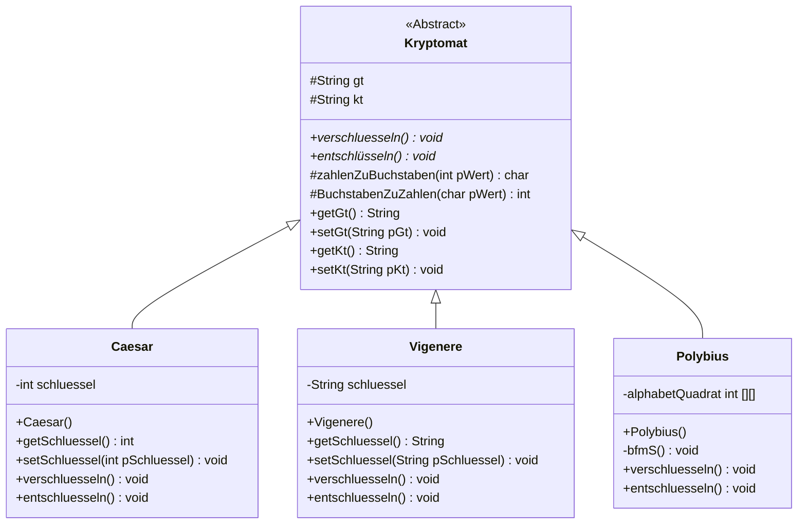

# Modellierung im Unterricht
Wir haben im Unterricht ein gemeimsames Klassendiagramm (also eine Schnittstellenvereinbarung) entwickelt. Zu einer Schnittstellenverinbarung gehört auch eine Dokumentation, damit eindeutig für alle beteiligten Entwickler festgelegt ist, was welche Methode leistet, wobei das "Wie" den Programmierern obliegt.

Für Polybius findet ihr unten eine mögliche Modellierung basierend auf einem 2-dimensionalem Array. Informiert euch im Buch auf Seite 53 ff. über mehrdimensionale Arrays.

:::alert{info}
**Für die Schnellen:** Findet eine Lösung ohne die Verwendung eines 2-dimensionalen Arrays und auf der Basis eines Strings.
:::

# Klassendiagramm der gemeinsamen Modellierungsphase



# Dokumentation der gemeinsamen Modellierung (fehlt noch)

# Quellcode
:::protect{password="Polybius" description="Wie heißt das Verfahren?"}
```java
/**
  *
  * Beschreibung
  *
  * @version 
  * @author 
  */

public class Polybius extends Kryptomat {
  
  // Anfang Attribute
  private int[][] buchstabenArray;
  // Ende Attribute
  
  public Polybius() {
    super();
    this.buchstabenArray = new int [6][6];
  }

  // Anfang Methoden
  public String verschluesseln() {
    zKlartext=zKlartext.toUpperCase();
    befuelleArray();
    for(int i=0; i<=zKlartext.length()-1; i++)
    {
      int k=(int)zKlartext.charAt(i);
      for(int x=1; x<6; x++)
      {
        for(int y=1; y<6; y++)
        {
          if(k==buchstabenArray[x][y])
          {
            k=buchstabenArray[x][y];
            zGeheimtext=zGeheimtext+x+y+" ";
          }
        }
      }
    }
    return zGeheimtext;
  }

  public String entschluesseln() {
    befuelleArray();
    for(int i=0; i<=zGeheimtext.length()-1; i++)
    {
      int k=(int)zGeheimtext.charAt(i);      
      i++;
      int l=(int)zGeheimtext.charAt(i);      
      if((int)zGeheimtext.charAt(2)==32)     
      {
        i++;                                        
      }
      k=k-48;
      l=l-48;
      for(int x=1; x<6; x++)
      {
        for(int y=1; y<6; y++)
        {
          if(k==x && l==y)
          {
            char h=(char)buchstabenArray[x][y];
            zKlartext=zKlartext+h;
          }
        }              
      }
    }
    return zKlartext;
  }

  private void befuelleArray() {
    int hHilf = 65;
    for(int i=1; i<6; i++)
    {
      for(int j=1; j<6; j++)
      {
        buchstabenArray[i][j]=hHilf;
        if(hHilf==73)
        {
          hHilf=hHilf+2;
        }
        else
        {
          hHilf++;
        }
      }
    }
  }

  // Ende Methoden
} // end of Polybius
```
:::
