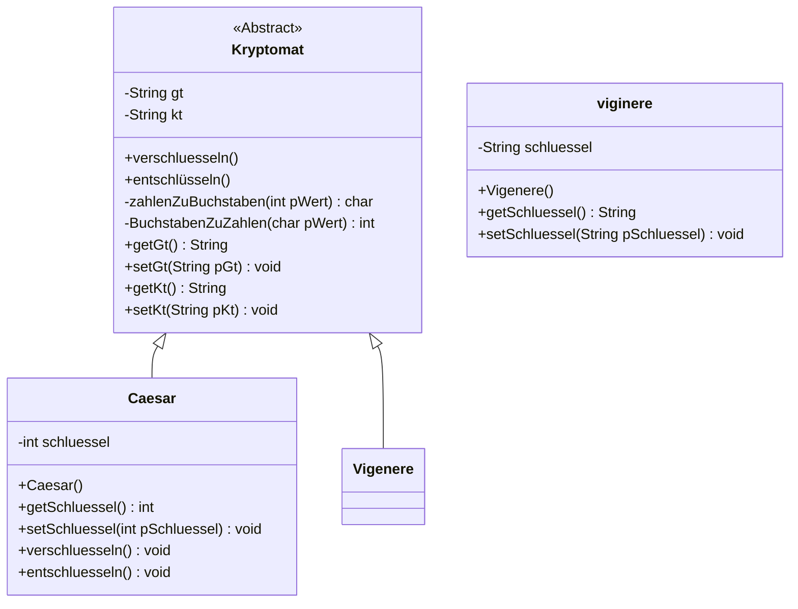

# Die abstrakte Oberklasse Kryptomat

```mermaid
classDiagram
    Kryptomat <|-- Caesar
    Kryptomat <|-- Vigenere
    <<Abstract>> Kryptomat
    Kryptomat : -String gt
    Kryptomat : -String kt
    Kryptomat: +verschluesseln()
    Kryptomat: +entschlüsseln()
    Kryptomat: -zahlenZuBuchstaben(int pWert) char
    Kryptomat: -BuchstabenZuZahlen(char pWert) int
    Kryptomat: +getGt() String
    Kryptomat: +setGt(String pGt) void
    Kryptomat: +getKt() String
    Kryptomat: +setKt(String pKt) void

    class Caesar{
      -int schluessel
      +Caesar()
      +getSchluessel() int
      +setSchluessel(int pSchluessel) void 
      +verschluesseln() void
      +entschluesseln() void
    }
    class viginere{
      -String schluessel
      +Vigenere()
      +getSchluessel() String
      +setSchluessel(String pSchluessel) void
    }
    
```
