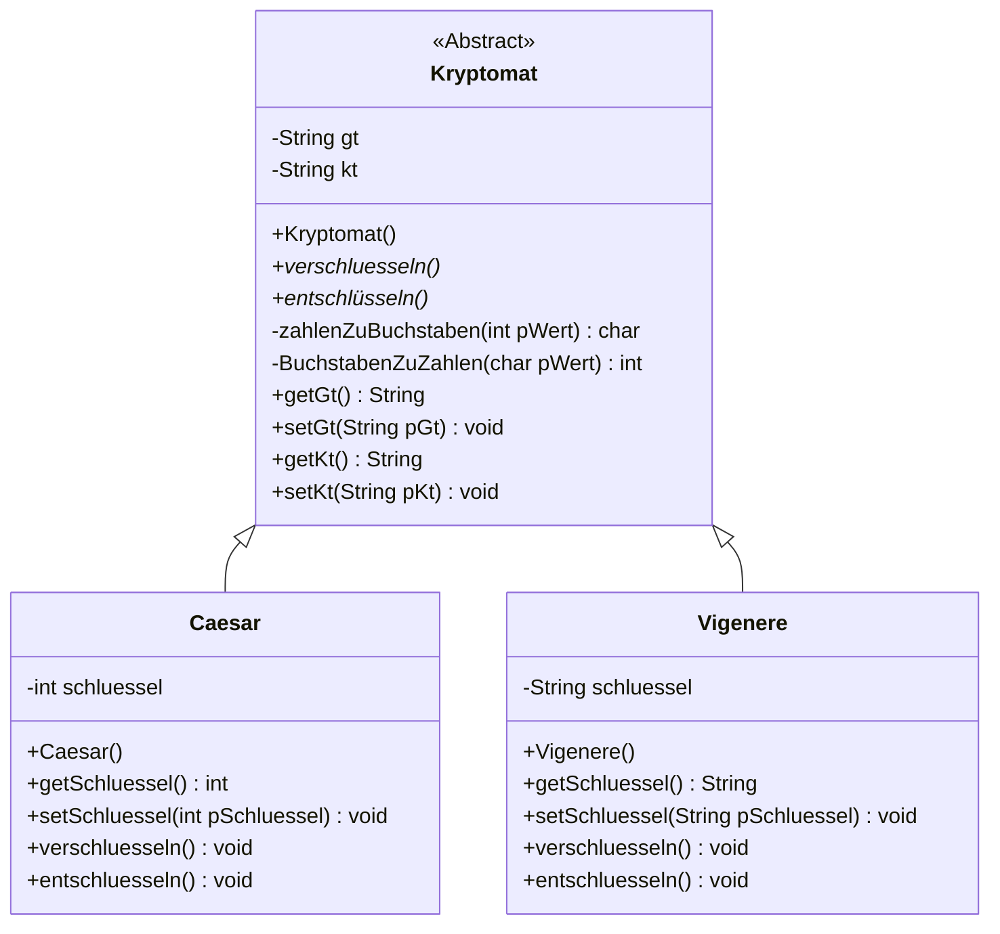

# Die abstrakte Oberklasse Kryptomat
Die gemeinesame Modellierung/Schnittstellenvereinbarung hat folgendes Klassendiagramm ergeben.

## Dokumentation
### Klasse Kryptomat
**Kryptomat()**

Ein Objekt der Klasse Kryptomat wird erzeugt. Hierbei wird der Klartext und der Geheimtext mit keinem Wert initialisiert.

**void verschluesseln()**

Abstrakte Methode der Oberklasse zum verschlüsseln.

**void entschluesseln()**

Abstrakte Methode der Oberklasse zum entschlüsseln.

**char zahlenZuBuchstaben(int pWert)**

Die Anfrage liefert zu einem Zahlenwert den nach ASCII Tabelle passenden Buchstaben.

**int buchstabenZuZahlen(char pWert)**

Die Anfrage liefert zu einem Buchstaben den nach ASCII Tabelle passenden Zahlenwert.

**String getGt()**

Die Anfrage gibt den verschlüssleten Text (Geheimtext) wieder (Wert des Attributs gt).

**void setGt(String pGt)**

Setze Methode für den Geheimtext auf den Wert des Parameters pGt.

**String getKt()**

Die Anfrage gibt den unverschlüssleten Text (Klartext) wieder (Wert des Attributs kt).

**void setKt(String pKt)**

Setze Methode für den Klartext auf den Wert des Parameters pKt.

### Klasse Caesar
**Caesar()**

Ein Objekt der Klasse Caesar wird erzeugt. Hierbei wird der Klartext und der Geheimtext mit keinem Wert initialisiert und der Wert für den Schlüssel auf 0 gesetzt.

**void verschluesseln()**

Der Klartext wird mit Hilfe des Schluessels nach der Caesarmethode verschluesselt. Sind weder Schluessel und/oder Klartext gesetzt wird das "leere" Wort mit einem Schlüsselwert von 0 verschluesselt. Beim Verschlüsseln werden nur Grossbuchstaben verschlüsslelt.

**void entschluesseln()**

Der verschlüsselte Text (Geheimtext) wird nach der Caesarmethode entschlusslet und speichert den entschlüssleten Text im Attribut für den Klartext (kt).

**int getSchluessel()**

Die Anfrage gibt den des Schlüssels wieder (Wert des Attributs schluessel).

**void setSchluessel(int pSchluessel)**

Setze Methode für den Schlüssel auf den Wert des Parameters pSchluessel.
### Klasse Viginere
**Viginere()**

Ein Objekt der Klasse Viginere wird erzeugt. Hierbei wird der Klartext und der Geheimtext mit keinem Wert und der Schlüssel mit A (also Verschiebung um keinen Wert) initialisiert.

**void verschluesseln()**

Der Klartext wird mit Hilfe des Schluessels nach der Vigineremethode verschluesselt. Sind weder Schluessel und/oder Klartext gesetzt wird das "leere" Wort mit einem Schlüsselwert von 0 verschluesselt. Beim Verschlüsseln werden nur Grossbuchstaben verschlüsslelt.

**void entschluesseln()**

Der verschlüsselte Text (Geheimtext) wird nach der Vigineremethode entschlüsslet und speichert den entschlüssleten Text im Attribut für den Klartext (kt).

**String getSchluessel()**

Die Anfrage gibt den des Schlüssels wieder (Wert des Attributs schluessel).

**void setSchluessel(int pSchluessel)**

Setze Methode für den Schlüssel auf den Wert des Parameters pSchluessel.
