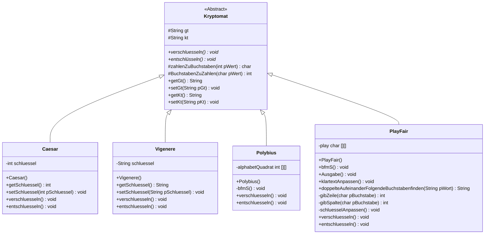

# Klassendiagramm der gemeinsamen Modellierungsphase



# Dokumentation der gemeinsamen Modellierung (fehlt noch)

# Quellcodehilfe
:::protect{password="PlayFair" description="Wie heißt das Verfahren?"}
```java
/**
* Beschreiben Sie hier die Klasse PlayFair. Zur Vereinfachung der Situation gehen wir momentan davon aus, dass im Schlüsselwort 
* keine doppelten Buchstaben vorkommen und der Klartext maximal einmal einen doppelten Buchstaben erhält
*
* @author Sebastia Horn
* @version 0.1
*/
public class PlayFair extends Kryptomat
{
    // Instanzvariablen - ersetzen Sie das folgende Beispiel mit Ihren Variablen
    private char[][] play;
    
    /**
    * Konstruktor f? Objekte der Klasse PlayFair
    */
    public PlayFair()
    {
        play = new char[5][5];
        kt="KUCHENDIEB";
        schluessel = "MAUS";
        schluessel.replace('J','I');
        kt.replace('J','I');
        kt = this.doppelteAufeinanderFolgendeBuchstabenfinden(kt);
        schluessel = this.schluesselAnpassen();
        this.matrixBefuellen();
        this.matrixAusgabe();
        this.verschluesseln();
    }
    /**
     * Befuellt die Matrix nach dem PlayFair Verfahren. Erst wird das Schluesselwort eingesetzt,
     * anschliessend die restlichen Buchstaben des Alphabets.
     * 1. Version: Wir gehen davon aus, dass im Schlüssel keine doppelten Buchstaben vorkommen.
     * 2. Version für Schnelle: Implementiert die Methode schluesselAnpassen() die doppelte Buchstaben 
     * aus dem Schluessel entfernt.
     */
    public void bfmS()
    {
        StringBuilder hAlphabet = new StringBuilder("ABCDEFGHIKLMNOPQRSTUVWXYZ");       
        kt = this.doppelteAufeinanderFolgendeBuchstabenfinden(kt);
        this.klartextAnpassen();       
        StringBuilder hilfSchluessel = new StringBuilder(schluessel);        
        for(int i = 0; i<5;i++)
        {
            for(int j = 0; j<5; j++)
            {
                //Matrix mit Schluessel befüllen
                if(hilfSchluessel.length()>0)
                { 
                   //dein Quellcode hier
                }
                else
                {
                    //Matrix mit restlichen Buchstaben des Alphabets füllen                  
                    while(hAlphabet.charAt(0)== ' ')
                    {
                        //wenn das Zeichen im Alphabet ein Leerzeichen ist loesche es
                        hAlphabet.deleteCharAt(0);
                    }                  
                    play[i][j] = hAlphabet.charAt(0);
                    hAlphabet.deleteCharAt(0);
                }
            }
        }
    }
    
    /**
     * Entfernt doppelte Buchstaben aus dem Schluessel. Diese Methode ist für schnelle gedacht.
     * 
     * @return hSchluessel angepasst z.B. HALLO wird zu HALO
     */
    private String schluesselAnpassen()
    {
        int doppelte = 0;
        StringBuilder hAlphabet = new StringBuilder("ABCDEFGHIKLMNOPQRSTUVWXYZ");
        StringBuilder hSchluessel = new StringBuilder(schluessel); 
        String rSchluessel;
        //Entferne den ersten Buchstaben des Schluessels aus dem Alphabet
        
        //Entfernt hier die weiteren doppelten Buchstaben 
        
        rSchluessel = hSchluessel.toString();
        return rSchluessel;
    }
    /**
     * Gibt die Matrix in der Konsole aus.
     */
    public void Ausgabe()
    {
        for(int i = 0;i <5;i++)
        {
            System.out.println("");
            for(int j = 0; j <5;j++)
            {
                System.out.print(play[i][j]+ " ");
            }
        }
    }
       
    /**
     * Passt den Klartext den Voraussetzungen an d.h. der Buchstabe J wird durch I ersetzt und bei einer ungeraden Anzahl an 
     * Zeichen wird der Klartext um den Buchstaben X erweitert.
     */
    private void klartextAnpassen()
    {
        schluessel.replace('J','I');
        kt.replace('J','I');
        if (kt.length() % 2 == 1)
        {
            kt = kt + 'X';
        }
    }
    /**
     * Die Methode findet doppelte aufeinander folgende Buchstaben wie z.B. LL in HALLO und ersetzt 
     * den zweiten doppelten Buchstaben durch ein X. So wird aus HALLO --> HALXO
     * 
     * @return String der übergebende Text ohne doppelte aufeinander folgende Buchstaben wird zurueckgegeben
     */
    private String doppelteAufeinanderFolgendeBuchstabenfinden(String pWort)
    {
        StringBuilder hilf = new StringBuilder(pWort);
        for(int i = 0; i< hilf.length()-1;i=i+2)
        {
            if(hilf.charAt(i)==hilf.charAt(i+1))
            {
                hilf.insert(i+1, 'X');
            }
        }
        String hilf2 = hilf.toString();
        return hilf2;
    }
    
    /**
     * Methode gibt die Zeile in der sich ein Buchstabe befindet zurueck.
     * 
     * @return hZeile des uebergebenden Buchstabens
     */
    private int gibZeile(char pBuchstabe)
    {
        int hZeile = 0;
        for(int zeile = 0; zeile < 5; zeile++)
        {
            for(int spalte = 0; spalte < 5; spalte++)
            {
                if(pBuchstabe == play[zeile][spalte])
                {
                    hZeile = zeile;
                }
            }
        }
        return hZeile;
    }
    
    /**
     * Methode gibt die Spalte in der sich ein Buchstabe befindet zurueck.
     * 
     * @return hSpaltee des uebergebenden Buchstabens
     */    
    private int gibSpalte(char pBuchstabe)
    {
        int hSpalte = 0;
        for(int zeile = 0; zeile < 5; zeile++)
        {
            for(int spalte = 0; spalte < 5; spalte++)
            {
                if(pBuchstabe == play[zeile][spalte])
                {
                    hSpalte = spalte;
                }
            }
        }
        return hSpalte;
    }
    
    /**
     * Methode zum Verschluesseln eines Klartext nach der PlayFair Methode
     * 
     * @return String das verschluesselte Wort (gt) wird zurueckgedgeben
     */
    public void verschluesseln()
    {
        int hilf1, hilf2 = 0;
        StringBuilder hGeheimtext = new StringBuilder(gt);
        //For Schleife ueber die Klartextlaenge -1
        
            // Erster Fall: gleiche Zeile
           
            // Zweiter Fall: gleiche Spalte
            
            //Dritter Fall: Weder gleiche Spalte noch Zeile; j tauschen
            
        
        gt = hGeheimtext.toString();
        return gt;
     }
    
    /**
     * Methode zum Entschluesseln eines Geheimtexts nach der PlayFair Methode
     * 
     * @return String das entschluesselte Wort (hEntschluesselt) wird zurueckgedgeben
     */
    public void entschluesseln() 
    {
        int hilf1, hilf2 = 0;
        StringBuilder hEntschluesselt = new StringBuilder("");
        //For Schleife ueber Geheimtextlaenge -1
        
            // Erster Fall: gleiche Zeile
           
            // Zweiter Fall: gleiche Spalte
            
            //Dritter Fall: Weder gleiche Spalte noch Zeile; j tauschen
             
        return hEntschluesselt.toString();
    }
}
```
:::

