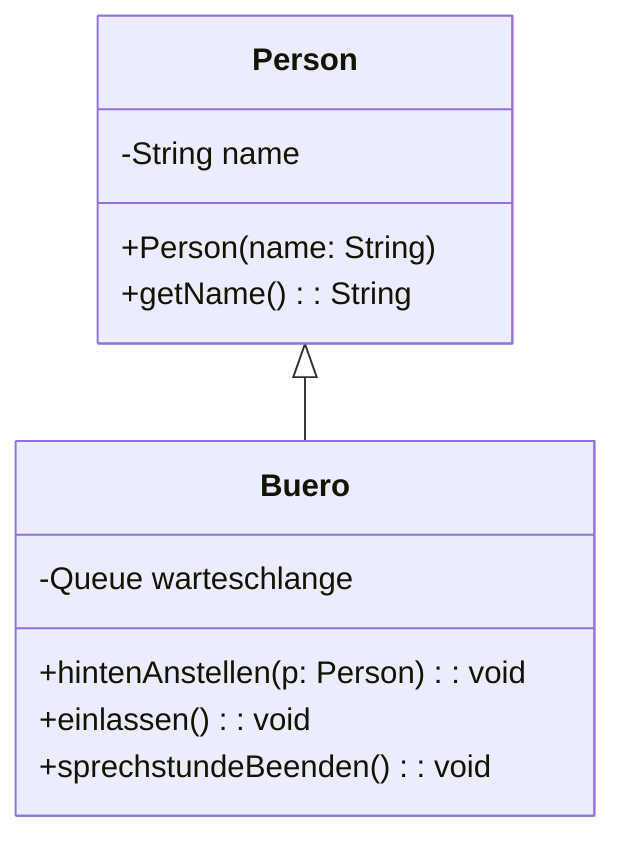

# Queue Lösung von Tom

::::tabs
:::tab{title="Java Quellcode"}
Als Grundlage wird unsere Queue verwendet.
```java
public class Buero
{
    private Queue<Person> warteschlange;
    
    public Buero() {
        warteschlange = new Queue<>();
    }
    
    public void hintenAnstellen(Person p) {
        this.warteschlange.enqueue(p);
    }
    
    public void einlassen() {
        Person person = this.warteschlange.dequeue();
        System.out.println(person.getName() + " wurde in die Sprechstunde geschickt");
    }
    
    public void sprechstundeBeenden() {
        this.warteschlange.clear();
    }
}
```
:::
:::tab{title="Klassendokumentation"}
Als Grundlage wird unsere Queue verwendet.



# Queue und Stack Lösung von Marouane und Zagros

```mermaid


    
    Queue~ContentType~ <-- Buero:PersonWarteSchlange
    Person  <-- Buero
    Queue~ContentType~ : 
    Queue~ContentType~ : 
    Queue~ContentType~: 
    Queue~ContentType~: 
    

    class Person {
        -name:String
        +getName():String

    }
  
    

    class Buero{

      +hintenAnstellen()
      +Einlassen()
      +sprechstundeBeenden()
    
    }
    
```
  
    

    class Buero{

      +hintenAnstellen()
      +Einlassen()
      +sprechstundeBeenden()
    
    }
    


```


```java


/**
 * Beschreiben Sie hier die Klasse Buero.
 * 
 * @author (Ihr Name) 
 * @version (eine Versionsnummer oder ein Datum)
 */
public class Buero
{
    // Instanzvariablen - ersetzen Sie das folgende Beispiel mit Ihren Variablen
    private Queue<Person> warteschlange;

    /**
     * Konstruktor für Objekte der Klasse Buero
     */
    public Buero()
    {
        // Instanzvariable initialisieren
        warteschlange= new Queue<Person>();
    }

    public void hintenAnstellen(Person pPerson)
    {
        warteschlange.enqueue(pPerson);
        
    }
    
    public void einlassen()
    {
        warteschlange.dequeue();
    }
    
    public void sprechstundeBeenden()
    {
        while(!warteschlange.isEmpty())
        {
            warteschlange.dequeue();
        }
    }
    

/**
 * Klasse Person
 * 
 * @author (Marouane) 
 * @version (01.02.2023)
 */
public class Person
{
    // Instanzvariablen - ersetzen Sie das folgende Beispiel mit Ihren Variablen
    private String name;

    /**
     * Konstruktor für Objekte der Klasse Person
     * Gibt der Person ihren Namen
     */
    public Person(String pName)
    {
        // Instanzvariable initialisieren
        name=pName;
    }

    /**
     * Gibt den Namen der Person zurück
     */
    public String getName()
    {
        return name;
    }
}


}
```
