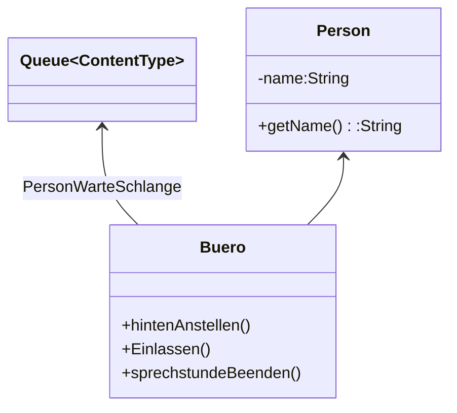

# Queue Lösung von <Name einsetzen>



```java


/**
 * Klasse Person
 * 
 * @author (Marouane) 
 * @version (01.02.2023)
 */
public class Person
{
    // Instanzvariablen - ersetzen Sie das folgende Beispiel mit Ihren Variablen
    private String name;

    /**
     * Konstruktor für Objekte der Klasse Person
     * Gibt der Person ihren Namen
     */
    public Person(String pName)
    {
        // Instanzvariable initialisieren
        name=pName;
    }

    /**
     * Gibt den Namen der Person zurück
     */
    public String getName()
    {
        return name;
    }
}


/**
 * Beschreiben Sie hier die Klasse Buero.
 * 
 * @author (Ihr Name) 
 * @version (eine Versionsnummer oder ein Datum)
 */
public class Buero
{
    // Instanzvariablen - ersetzen Sie das folgende Beispiel mit Ihren Variablen
    private Queue<Person> warteschlange;

    /**
     * Konstruktor für Objekte der Klasse Buero
     */
    public Buero()
    {
        // Instanzvariable initialisieren
        warteschlange= new Queue<Person>();
    }

    public void hintenAnstellen(Person pPerson)
    {
        warteschlange.enqueue(pPerson);
        
    }
    
    public void einlassen()
    {
        warteschlange.dequeue();
    }
    
    public void sprechstundeBeenden()
    {
        while(!warteschlange.isEmpty())
        {
            warteschlange.dequeue();
        }
    }
    
}

```
