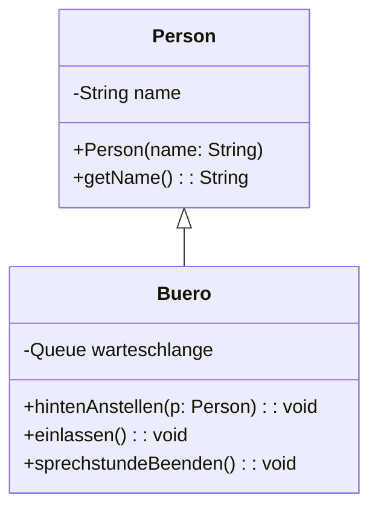

# Queue Lösung von Tom

::::tabs
:::tab{title="Java Quellcode"}
Als Grundlage wird unsere Queue verwendet.
```java
public class Buero
{
    private Queue<Person> warteschlange;
    
    public Buero() {
        warteschlange = new Queue<>();
    }
    
    public void hintenAnstellen(Person p) {
        this.warteschlange.enqueue(p);
    }
    
    public void einlassen() {
        Person person = this.warteschlange.dequeue();
        System.out.println(person.getName() + " wurde in die Sprechstunde geschickt");
    }
    
    public void sprechstundeBeenden() {
        this.warteschlange.clear();
    }
}
```
:::
:::tab{title="Klassendokumentation"}
Als Grundlage wird unsere Queue verwendet.

:::
