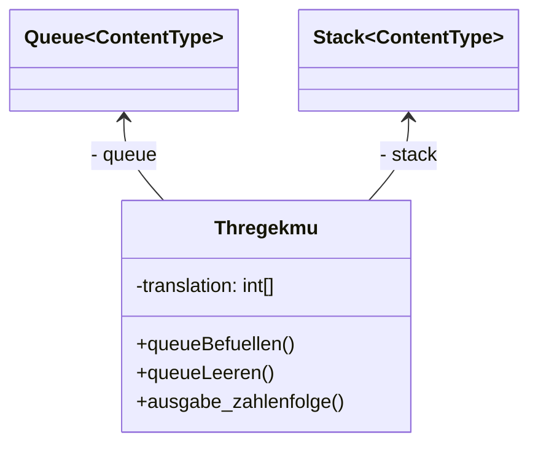

# Stack Lösung von Tim und Sarah

::::tabs{id="Stack"}

:::tab{title="ZA Implementation" id="ZA Implementation"}



```java

public class ZATrhekegmu
{
    private int[] zahlenfolge = new int[10];

    private ZAQueue<Integer> queue = new ZAQueue<Integer>();
    private ZAStack<Integer> stack = new ZAStack<Integer>();
    /**
     * Konstruktor für Objekte der Klasse ZATrhekegmu.
     * Der Konstruktor leert die Queue und befüllt ein Array mit Zahlen,
     * welche später in die Queue geführt wird.
     */
    public ZATrhekegmu()
    {
        queueLeeren();
        
        for(int i = 0; i < zahlenfolge.length; i++){
            zahlenfolge[i] = i; 
        }
    }

    /**
     * Die Queue wird befüllt mit den Zahlen aus dem Array "zahlenfolge".
     */
    public void queueBefuellen()
    {
        for(int i = 0; i < zahlenfolge.length; i++){
            queue.enqueue(zahlenfolge[i]);
        }
    }

    /**
     * Die Queue wird geleert.
     */
    public void queueLeeren()
    {
        while(queue.front() != null){
            queue.dequeue();
        }
    }

    /**
     * Die in der Queue gespeicherte Zahlenfolge wird umgekehrt in ein Stack übertragen und wird dann in der Konsole ausgegeben.
     * Die Zahlenfolge ist umgekehrt.
     */
    public void ausgabe_zahlenfolge()
    {
        queueLeeren();
        queueBefuellen();

        while(queue.front() != null){
            stack.push(queue.front());
            queue.dequeue();
        }

        while(stack.top() != null){
            System.out.print(stack.top() + ", ");
            stack.pop();
        }
    }
}
```

:::

:::tab{title="Q1 Implementation" id="Q1 Implementation"}
```java
public class List
{
    private Elephant firstElement;
    private Elephant searchedElement;
    private Elephant lastElement;
    /**
     * Konstruktor
     */
    public List(Elephant pElephant){
        firstElement = pElephant;
        lastElement = pElephant;
    }
    /**
    *Füge ein Element am Ende der Liste hinzu
    *@param Elephant pElephant
    */
    public void append(Elephant pElephant){
        lastElement.setNext(pElephant);
        lastElement = lastElement.getNext();
    }
    /**
    * Erhalte den Wert von einem Element an einer pestimten Position
    * @param int pos
    * @return Elephant searchedElement
    */
    public Elephant get(int pos){
        setSearched(pos);
        return searchedElement;
    }
    /**
    * Ändere das Element an einer bestimten Position
    * @param Elephant pElephant
    * @param int pos
    */
    public void set(Elephant pElephant, int pos){
        setSearched(pos);
        pElephant.setNext(searchedElement.getNext());
        remove(pos);
        add(pElephant, pos);
    }
    /**
    * Füge ein Element an einer bestimmten Position in der Liste hinzu
    * @param Elephant pElephant
    * @param int pos
    */
    public void add(Elephant pElephant, int pos){
        setSearched(pos);
        pElephant.setNext(searchedElement);
        Elephant tmp = searchedElement;
        setSearched(pos - 1);
        searchedElement.setNext(pElephant);
    }
    /**
    * Entfernt ein Element an einer bestimmten Position in der Liste
    * @param int pos
    */
    public void remove(int pos){
        setSearched(pos + 1);
        Elephant tmp = searchedElement;
        setSearched(pos - 1);
        searchedElement.setNext(tmp);
    }
    /**
     * interne Funktion die ein gesuchtes Element in einer Methodenübergreifenden Variable
     */
    private void setSearched(int pos){
        Elephant ele = firstElement;
        for(int i = 0; i < pos; i++){
            ele = ele.getNext();
        }
        searchedElement = ele;
    }
}```

:::
::::


