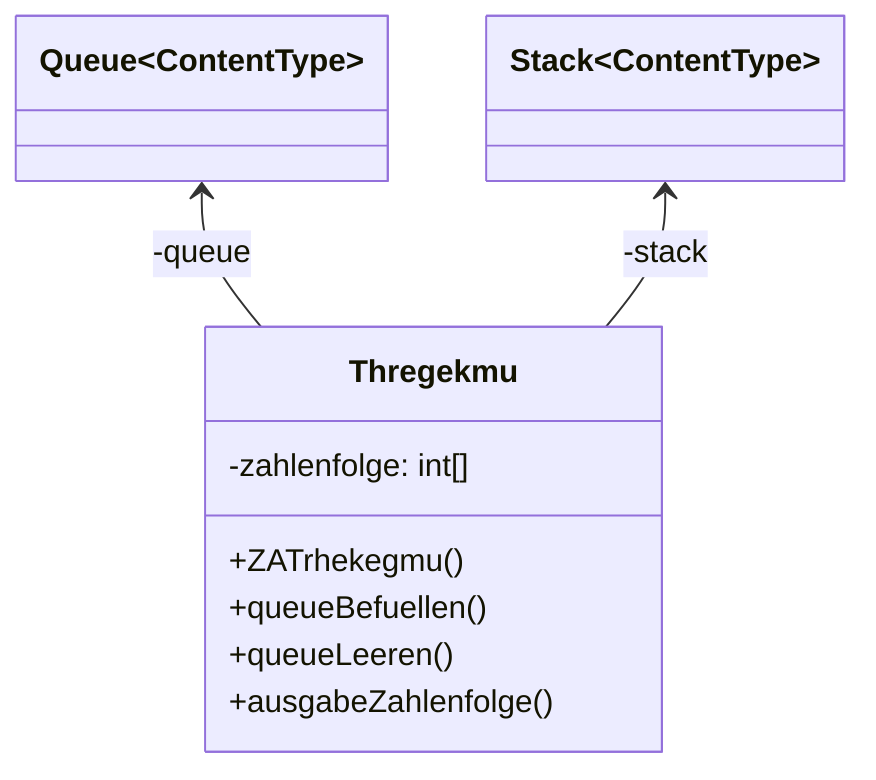
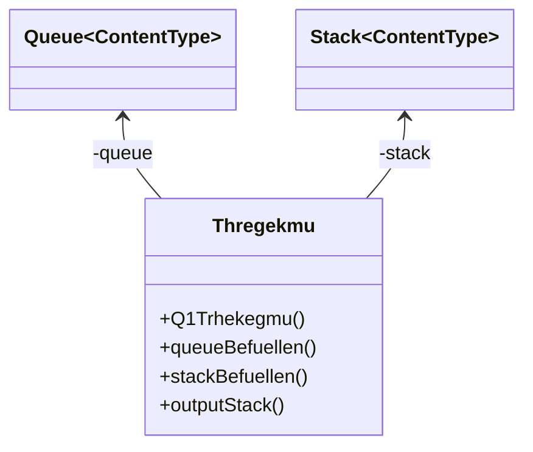

# Stack Lösung von Tim und Sarah

::::tabs{id="Stack"}

:::tab{title="ZA Implementation" id="ZA Implementation"}

### Implementationsdiagramm



### Quellcode der Klasse "ZATrhekegmu"

```java

public class ZATrhekegmu
{
    private int[] zahlenfolge = new int[10];

    private ZAQueue<Integer> queue = new ZAQueue<Integer>();
    private ZAStack<Integer> stack = new ZAStack<Integer>();

    /**
     * Konstruktor für Objekte der Klasse ZATrhekegmu.
     * Der Konstruktor leert die Queue und befüllt ein Array mit Zahlen,
     * welche später in die Queue geführt wird.
     */
    public ZATrhekegmu()
    {
        queueLeeren();
        
        for(int i = 0; i < zahlenfolge.length; i++){
            zahlenfolge[i] = i; 
        }
    }

    /**
     * Die Queue wird befüllt mit den Zahlen aus dem Array "zahlenfolge".
     */
    public void queueBefuellen()
    {
        for(int i = 0; i < zahlenfolge.length; i++){
            queue.enqueue(zahlenfolge[i]);
        }
    }

    /**
     * Die Queue wird geleert.
     */
    public void queueLeeren()
    {
        while(queue.front() != null){
            queue.dequeue();
        }
    }

    /**
     * Die in der Queue gespeicherte Zahlenfolge wird umgekehrt in ein Stack übertragen und wird dann in der Konsole ausgegeben.
     * Die Zahlenfolge ist umgekehrt.
     */
    public void ausgabeZahlenfolge()
    {
        queueLeeren();
        queueBefuellen();

        while(queue.front() != null){
            stack.push(queue.front());
            queue.dequeue();
        }

        while(stack.top() != null){
            System.out.print(stack.top() + ", ");
            stack.pop();
        }
    }
}
```

:::

:::tab{title="Q1 Implementation" id="Q1 Implementation"}

### Implementationsdiagramm


### Quellcode der Klasse "Q1Trhekegmu"

```java
import java.util.Arrays;

public class Q1Trhekegmu{
    Q1Queue<Integer> queue = new Q1Queue<Integer>();
    Q1Stack<Integer> stack = new Q1Stack<Integer>();
    
    public Q1Trhekegmu(){
        queueBefuellen();
        stackBefuellen();
        outputStack();
    }
    
    private void queueBefuellen(){
        int[] arr = {10, 4, 6, 8, 1, 3, 2};
        System.out.println(Arrays.toString(arr));
        for(int i = 0; i < arr.length; i++){
            queue.hintenAnstellen(arr[i]);
        }
    }
    private void stackBefuellen(){
        for(int i = 0; i < 7; i++){
            stack.add(queue.gibErsten());
            queue.schickeErsten();
        }
    }
    private void outputStack(){
        Q1Stack tmpStack = stack;
        String out = "";
        for(int i = 0; i < 7; i++){
            out += tmpStack.getContent() + ", ";
            tmpStack.remove();
        }
        System.out.println(out);
    }
}

```

:::
::::


