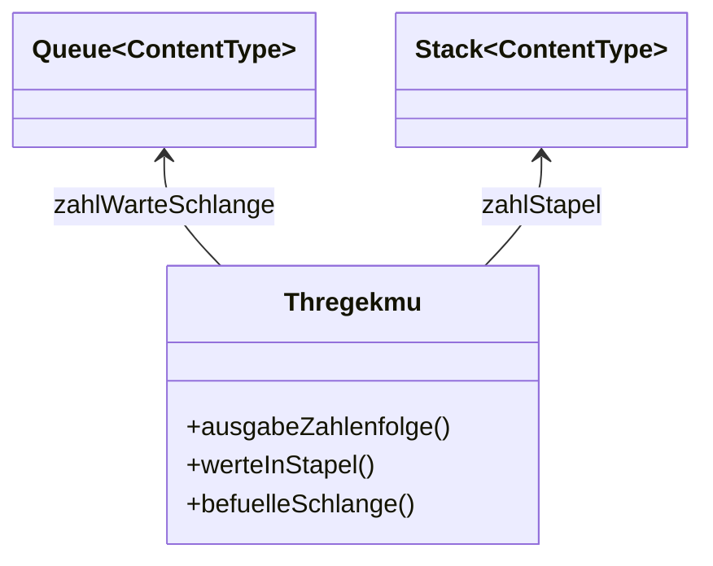

# Stack Lösung von Marouane und Zagros



```java 


/**
 * Beschreiben Sie hier die Klasse Trhekegmu.
 * 
 * @author (Ihr Name) 
 * @version (eine Versionsnummer oder ein Datum)
 */
public class Trhekegmu
{
    // Instanzvariablen - ersetzen Sie das folgende Beispiel mit Ihren Variablen
    private Queue<Integer> warteSchlange= new Queue<>();
    private Stack<Integer> stapel=new Stack<>();

    /**
     * Konstruktor für Objekte der Klasse Trhekegmu
     */
    public Trhekegmu()
    {
        // Instanzvariable initialisieren
        
    }

    public void befuelleSchlange(int pZahl)
    {
        warteSchlange.enqueue(pZahl);
    }
    
    public void werte_in_Stapel()
    {
        while(! warteSchlange.isEmpty())
        {
            stapel.push(warteSchlange.front());
            warteSchlange.dequeue();
        }
    }
    
    public void ausgabe_zahlenfolge()
    {
        while(!stapel.isEmpty())
        {
            System.out.println(stapel.top());
            stapel.pop();
        }
    }
}


```
