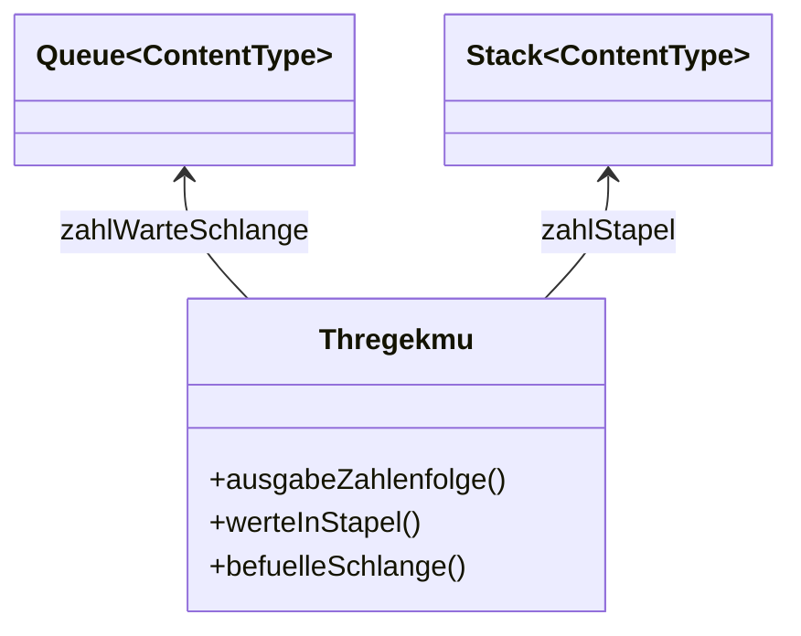

# Stack Lösung von Tim und Sarah

# Stack Lösung von Marouane und Zagros

```mermaid
classDiagram
    
    Queue~ContentType~ <-- Thregekmu:zahlWarteSchlange
    Stack~ContentType~ <-- Thregekmu:zahlStapel
    Queue~ContentType~ : 
    Queue~ContentType~ : 
    Queue~ContentType~: 
    Queue~ContentType~: 
    Stack~ContentType~ 

    class Stack~ContentType~
    
    

    class Thregekmu{

      +ausgabeZahlenfolge()
      +werteInStapel()
      +befuelleSchlange()
    
    }
```
