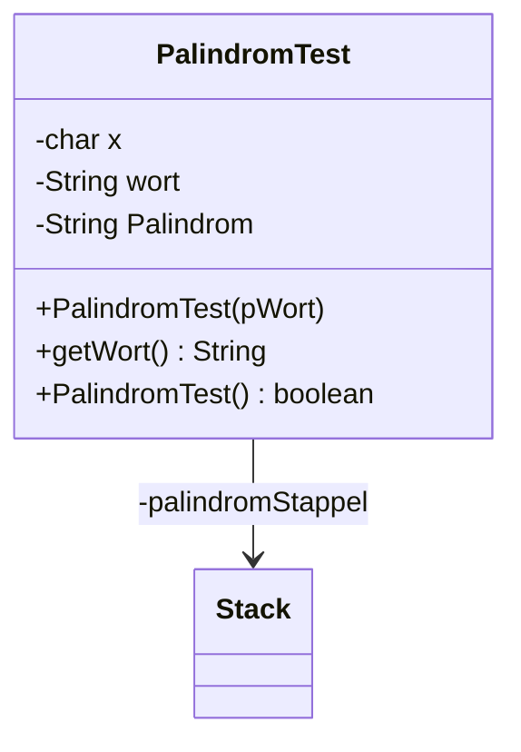

# Queue Lösung von <Yassin und Leo>

# Lösung der Aufgabe

Nr.4 
a) 

Man fügt den Begriff, welcher auf ein Palindrom überprüft werden soll in ein Stack hinzu. Als erstes wird der erste Buchstabe des Worts in den Stack gefügt, dann der zweite usw.
Sobald der Stack gebildet wurde, wird der oberste Buchstabe im Stack im String Palindrom gespeichert und im Stack entfernt, wodurch der letzte Buchstabe der erste ist. Danach wird das gleich mit dem Rest gemacht.
Zum Schluss wird der String Palindrom mit dem Begriff verglichen.
Trifft diese Aussage zu, ist dieses Wort ein Palindrom.

b)



Lösung mit unserer Klasse Stack: 

```java


public class PalindromTest
{
    
    private Stack1<Character> zahlenStack;
    private String wort;
    private String Palindrom; 
    char x; 
    
    public PalindromTest(String pWort)
    {
        
       zahlenStack= new Stack1<>();
        wort = pWort;
        x=' '; 
        Palindrom=""; 
        PalindromTest(); 

    }

    public String getWort(){
        return wort; 
    }

    public boolean PalindromTest(){

        for(int i=0; i< wort.length(); i++){
            x =wort.charAt(i);
            zahlenStack.add(x);

        }

        for( int j=0; j< wort.length(); j++){
            x=' '; 
            x= zahlenStack.getContent(); 
            Palindrom= Palindrom + x; 
            zahlenStack.remove(); 

        }
        
        if (Palindrom.equalsIgnoreCase(wort)){
            System.out.println("True"); 
            return true; 
        }
        else {
            System.out.println("False"); 
            return false; 
        }
    }

}
```
Lösung mit der Klasse Stack des Zentralabiturs:
```java 
public class PalindromTestV2
{
   
    private StackV2<Character> zahlenStack;
    private String wort;
    private String Palindrom; 
    char x; 
    
    public PalindromTestV2(String pWort)
    {
        
        zahlenStack= new StackV2<>();
        wort = pWort;
        x=' '; 
        Palindrom=""; 
        PalindromTest(); 

    }

    public String getWort(){
        return wort; 
    }

    public boolean PalindromTest(){

        for(int i=0; i< wort.length(); i++){
            x =wort.charAt(i);
            zahlenStack.push(x);

        }

        for( int j=0; j< wort.length(); j++){
            x=' '; 
            x= zahlenStack.top(); 
            Palindrom= Palindrom + x; 
            zahlenStack.pop(); 

        }
        
        if (Palindrom.equalsIgnoreCase(wort)){
            System.out.println("True"); 
            return true; 
        }
        else {
            System.out.println("False"); 
            return false; 
        }
    }

}

```

c)
Das Problem bei "bei liese sei lieb" sind die Leerzeichen. Denn durch diese ist am Ende der Ausführung unseres Programms "bei liese sei lieb" kein Palindrom mehr. So wären die Leerzeichen an den falschen Stellen im Satz gesetzt. 
Unser Ansatz wäre, alle Leerzeichen mit einer Methode zu entfernen. Dann überprüft man ob die Buchstabenreihnfolge, die bleibt, ein Palindrom ist. Wenn es true ist, dann setzt man an den selben Stellen wie vorher die Leerzeichen wieder ein.
