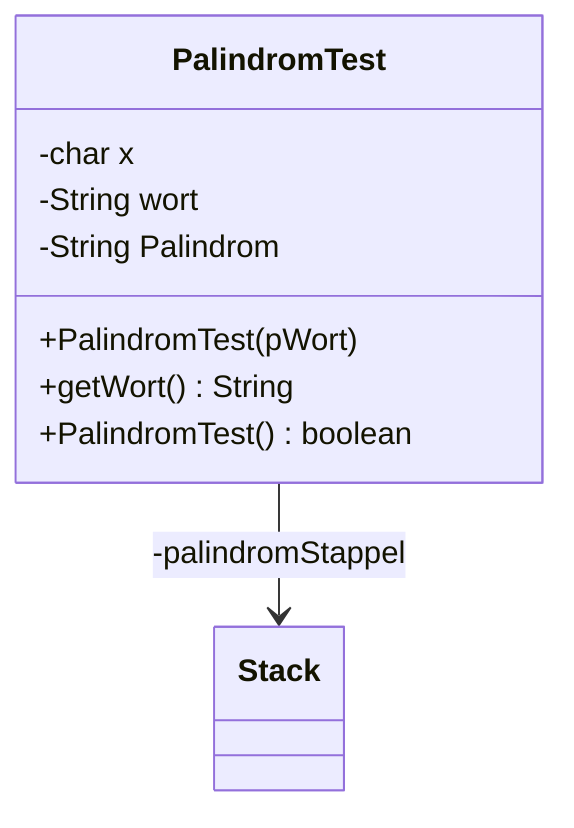

# Queue Lösung von <Yassin und Leo>

# Lösung der Aufgabe

Nr.4 
a) 

Man fügt den Begriff, welcher auf ein Palindrom überprüft werden soll in ein Stack hinzu. Als erstes wird der erste Buchstabe des Worts in den Stack gefügt, dann der zweite usw.
Sobald der Stack gebildet wurde, wird der oberste Buchstabe im Stack im String Palindrom gespeichert und im Stack entfernt, wodurch der letzte Buchstabe der erste ist. Danach wird das gleich mit dem Rest gemacht.
Zum Schluss wird der String Palindrom mit dem Begriff verglichen.
Trifft diese Aussage zu, ist dieses Wort ein Palindrom.

