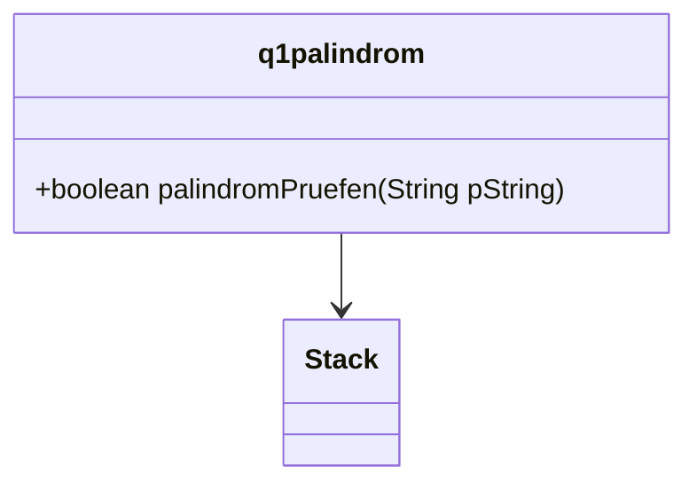

##Klassendiagramm 


::::tabs

:::tab{title="mit Q1Stack"}
```java 


    public q1palindrom()
    {
    }

    public boolean palindromPruefen(String pString)    
    {
        for(int i = 0; i<pString.length();i++)
        {
            stack.add(pString.charAt(i));

        }
        boolean ueberpruefe = true;
        int i = 0;
        while(stack.getContent() != null)
        {
 
            if (stack.getContent() == pString.charAt(i))
            {
            }
            else
            {
                ueberpruefe = false;
            }
            stack.remove();
            i++;
        }
        return ueberpruefe;
    }

}

:::

:::tab{title="mit ZAStack"}

public class palindrom
{


    
    public palindrom()
    {

    }

    public boolean palindromPruefen(String pString)    
    {
        for(int i = 0; i<pString.length();i++)
        {
            stack.push(pString.charAt(i));

        }
        boolean ueberpruefe = true;
        int i = 0;
        while(stack.top() != null)
        {
 
            if (stack.top() == pString.charAt(i))
            {
            }
            else
            {
                ueberpruefe = false;
            }
            stack.pop();
            i++;
        }
        return ueberpruefe;
    }

}


:::

::::


