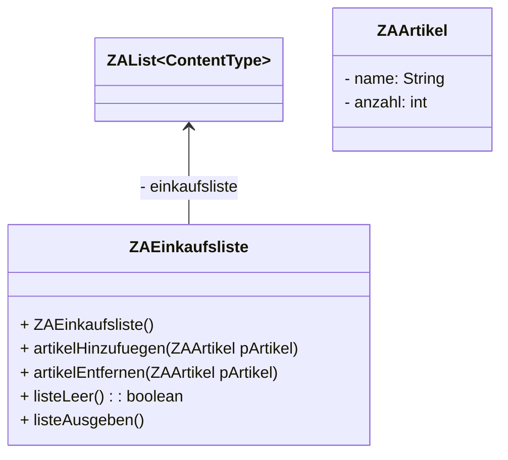
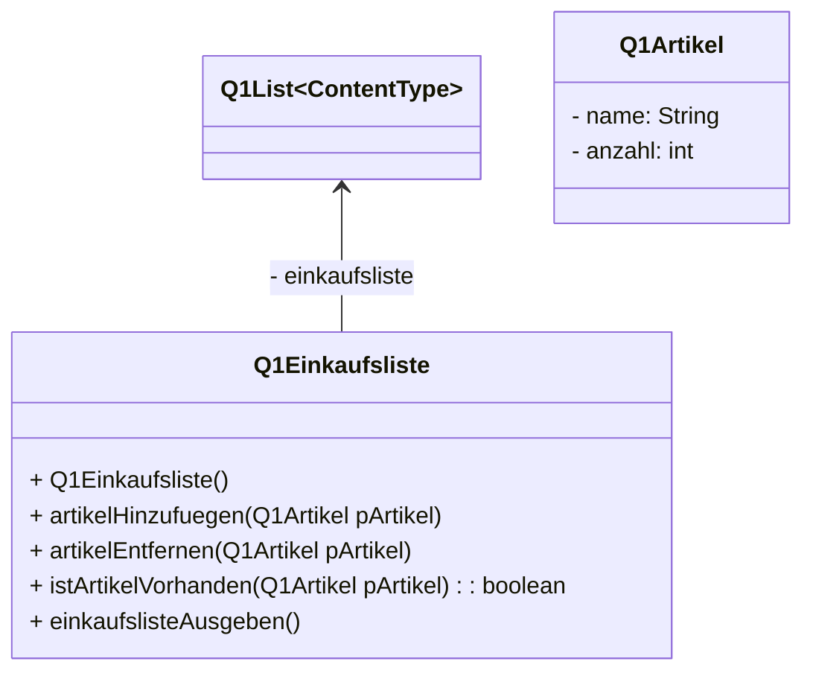

# List Lösung von Tim und Sarah

::::tabs{id="ListNr1"}
:::tab{title="ZA Implementation"}

### Implementationsdiagramm


### Quellcode der Klasse "ZAEinkaufsliste"

```java
/**
 * Diese Klasse erzeugt einen Einkaufszettel der verschiedene Artikel speichert.
 * Dieser Einkaufszettel kann ebenfalls ausgegeben werden.
 * 
 * @author (Sarah) 
 * @version (07.02.2023)
 */
public class ZAEinkaufsliste
{
    private ZAList<ZAArtikel> einkaufsliste = new ZAList();    

    /**
     * Kreiert ein Einkaufslistenobjekt.
     */
    public ZAEinkaufsliste()
    {

    }

    /**
     * Diese Methode fügt den übergebenen Artikel der Einkaufsliste hinten an.
     */
    public void artikelHinzufuegen(ZAArtikel pArtikel)
    {
        einkaufsliste.append(pArtikel);
    }

    /**
     * Diese Methode löscht den übergebenen Artikel aus der Einkaufsliste.
     */
    public void artikelEntfernen(ZAArtikel pArtikel)
    {
        einkaufsliste.toFirst();

        while(einkaufsliste.getContent() != pArtikel)
        {
            einkaufsliste.next();
        }

        einkaufsliste.remove();
    }

    /**
     * Diese Methode überprüft, ob die Liste leer ist.
     * Sie gibt 'true' zurück, wenn die Liste keine Artikel beinhält, ansonsten gibt die 'false' zurück.
     */
    public boolean listeLeer()
    {
        return einkaufsliste.isEmpty();
    }

    /**
     * Diese Methode gibt den Inhalt der Einkaufsliste in der Konsole aus.
     * Der Name und die Anzahl wird in der Reihenfolge ausgegeben in welcher sie in der Einkaufsliste gespeichert sind.
     */
    public void listeAusgeben()
    {
        einkaufsliste.toFirst();

    
        if(einkaufsliste.getContent() != null)
        {
            System.out.println("Einzukaufen:");
            while(einkaufsliste.getContent() != null)
            {
                System.out.println("- " + einkaufsliste.getContent().getName() + " (" + einkaufsliste.getContent().getAnzahl() + ")");
                einkaufsliste.next();
            }
        }
        else
        {
            System.out.println("Die Einkaufsliste ist leer :(");
        }

        System.out.println("-----------------");
    }

}
```

### Quellcode der Klasse "ZAArtikel"

```java
/**
 * Die Klasse stellt einen Einkaufsartikel dar. Objekte dieser Klasse besitzten einen Namen und eine Anzahl.
 * 
 * @author (Sarah) 
 * @version (07.02.2023)
 */
public class ZAArtikel
{
    private String name;
    private int anzahl;

    /**
     * Kreiert ein Artikelobjekt
     */
    public ZAArtikel(String pName, int pAnzahl)
    {
        name = pName;
        anzahl = pAnzahl;
    }
    
    public String getName()
    {
        return name;
    }
    
    public int getAnzahl()
    {
        return anzahl;
    }
}
```

:::

:::
:::tab{title="Q1 Implementation"}

### Implementationsdiagramm


### Quellcode der Klasse "Q1Einkaufsliste"

```java
/**
 * Beschreiben Sie hier die Klasse Q1Einkaufsliste.
 * 
 * @author (Tim) 
 * @version (07.02.2023)
 */
public class Q1Einkaufsliste
{
    private Q1List<Q1Artikel> einkaufsliste = new Q1List();
    
    /**
     * Konstruktor für Objekte der Klasse Q1Einkaufsliste
     */
    public Q1Einkaufsliste()
    {
        
    }
    
    public void artikelHinzufuegen(Q1Artikel pArtikel)
    {
        einkaufsliste.append(pArtikel);
    }
    
    public void artikelEntfernen(Q1Artikel pArtikel)
    {
        for(int i = 0; i < einkaufsliste.getSize(); i++){
            //if(einkaufsliste.get(i).istIdentisch(pArtikel)){
                //einkaufsliste.remove(i);
            //}
        }
    }
    
    public boolean istArtikelVorhanden(Q1Artikel pArtikel)
    {
        boolean istVorhanden = false;
        for(int i = 0; i < einkaufsliste.getSize(); i++){
            //if(einkaufsliste.get(i).istIdentisch(pArtikel)){
                //istVorhanden = true;
            //}
        }
        return istVorhanden;
    }
    
    public void einkaufslisteAusgeben(){
        for(int i = 0; i < einkaufsliste.getSize(); i++){
            System.out.println(einkaufsliste.get(i));
        }
    }
}
```

### Quellcode der Klasse "Q1Artikel"

```java
/**
 * Beschreiben Sie hier die Klasse Artikel.
 * 
 * @author (Tim) 
 * @version (eine Versionsnummer oder ein Datum)
 */
public class Q1Artikel
{
    private String name = "";
    private int anzahl = 0;

    /**
     * Konstruktor für Objekte der Klasse Artikel
     */
    public Q1Artikel(String pName, int pAnzahl)
    {
        name = pName;
        anzahl = pAnzahl;
    }
    
    public String getName()
    {
        return name;
    }
}
```
:::
::::

