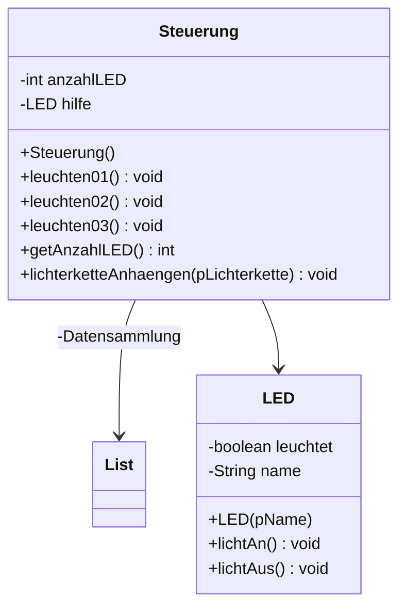

# List Lösung von Yassin und Leo


a)
Diese Entscheidung ist schlau, da man, wenn man die LED’s in einer Liste speichert, an jeder beliebigen Stelle eine LED entfernen bzw. hinzufügen kann. Außerdem kann man die Farbe jeder LED an einer beliebigen Stelle ändern. Dies kann man mit der Zeiger machen, welcher auf die zu Ändernde LED zeigt. So hat man über alle LED’s die volle Kontrolle, bei Datenstrukturen, wie die Queue oder der Stack hat man nicht den vollen Zugriff auf alle LED’s. Eine weitere sinnvolle Datenstruktur wäre vielleicht ein Array, aber hinsichtlich auf Aufgabenstellung e) ist eine List am schlausten und nützlichsten. 

b) 


c) und d)
Außerdem muss man bei der Klasse List eine Methode "getSize" ergänzen, diese returnt die Länge der Liste.  

``` java 
public class LED
{
   private boolean leuchtet;
    private String name; 

    
    public LED(String pName)
    {
        
        name = pName; 
        leuchtet = false; 
    }

    public void lichtAn(){
        leuchtet= true; 
        System.out.println("LED leuchtet"); 
    }
    public void lichtAus(){
        leuchtet = false; 
        System.out.println("LED leuchtet nicht");
    }
}


```

```java
 
public class Steuerung
{
    private int anzahlLED;
    private List<LED> Datensammlung ;
    private LED hilfe; 
 
    
    public Steuerung()
    {
       Datensammlung = new List<LED>(); 
       LED GRÜN= new LED("GRÜN"); 
       LED BLAU= new LED("BLAU"); 
       LED LILA = new LED("LILA"); 
       Datensammlung.append(LILA);
       Datensammlung.append(GRÜN);
       Datensammlung.append(BLAU);
       anzahlLED= Datensammlung.getSize();  
       
    }
public void LEDgitterErweitern(List pLichterkette){
    
}
   public void leuchten01(){
       for( int i=0; i< anzahlLED; i++){
           hilfe = Datensammlung.get1(i); 
          hilfe.lichtAn();
       }
   }
   public void leuchtet02(){
       for( int i=0; i< anzahlLED; i=+2){
           hilfe = Datensammlung.get1(i); 
          hilfe.lichtAn();
       } 
   }
   public void leuchtet03(){
       for( int i=0; i< anzahlLED; i=+2){
           hilfe = Datensammlung.get1(i); 
          hilfe.lichtAn();
          i++; 
       } 
   }
   public int getAnzahlLED(){
       return anzahlLED; 
   }
   public void lichterketteAnhaengen(List pLichterkette){
       while(pLichterkette!= null){
           Datensammlung.append(Datensammlung.getFirst()); 
           pLichterkette.remove(0); 
       }
        anzahlLED = anzahlLED+ pLichterkette.getSize(); 
       
       
   }
}
```

e)  
