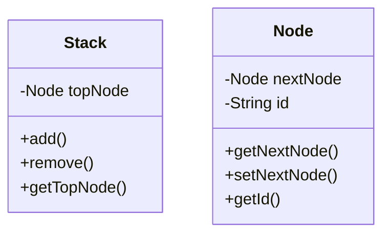

# Was ist ein Stack?
Ein Stack (auch Stapelspeicher genannt) ist eine dynamische Datenstruktur. Man hat eine Warteschlange, wobei jedes Objekt an den Anfang gehängt wird. Danach wird jedes Element von vorne bis hinten durchgegangen.

# Wie funktioniert ein Stack


::::tabs{id="Stack"}
:::tab{title="Klassendiagramm Stack" id="Klassendiagramm Stack"}

:::

:::tab{title="Java Stack" id="Java Stack"}
```java
public class Stack {
  private Node topNode;

  public Node getTopNode() {
    return topNode;
  }

  public void add(Node newNode) {
    newNode.setNextNode(topNode);
    topNode = newNode;
  }

  public void remove() {
    topNode = topNode.getNextNode();
  }
}

public class Node {

  private Node nextNode;
  private final String id;

  public Node(String id) {
    this.id = id;
  }

  public Node getNextNode() {
    return nextNode;
  }

  public void setNextNode(Node nextNode) {
    this.nextNode = nextNode;
  }

  public String getId() {
    return id;
  }
}
``` 
:::
::::
