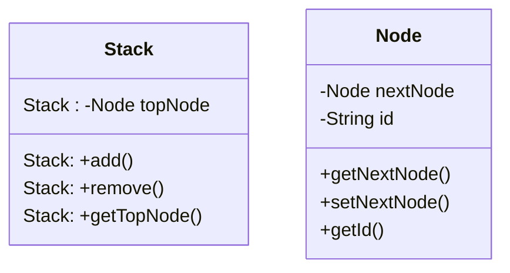

::::tabs{id="Stack"}

:::tab{title="Klassendiagramm" id="Klassendiagramm"}

:::

:::tab{title="Java" id="Java Quellcode"}
```java
public class Stack {
  private Node topNode;

  public Node getTopNode() {
    return topNode;
  }

  public void add(Node newNode) {
    newNode.setNextNode(topNode);
    topNode = newNode;
  }

  public void remove() {
    topNode = topNode.getNextNode();
  }
}

public class Node {

  private Node nextNode;
  private final String id;

  public Node(String id) {
    this.id = id;
  }

  public Node getNextNode() {
    return nextNode;
  }

  public void setNextNode(Node nextNode) {
    this.nextNode = nextNode;
  }

  public String getId() {
    return id;
  }
}
``` 
:::
::::

## Dokumentation der Modellierung
### Klasse Stack

**Stack()**

Ein Objekt der Klasse Stack wird erzeugt.

**void add()**

Fügt eine Node zum Stack hinzu.

**void remove()**

Entfernt eine Node vom Stack.

**Node getTopNode()**

Gibt die erste Node zurück.
