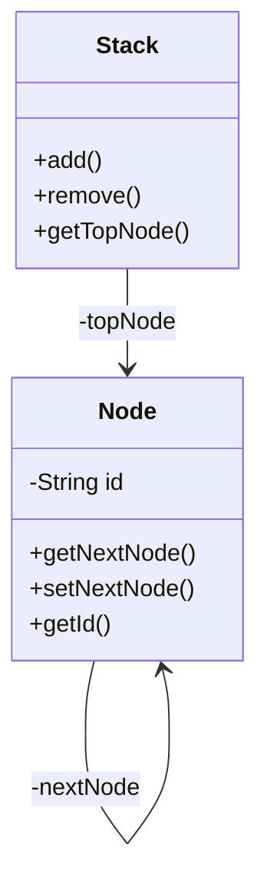
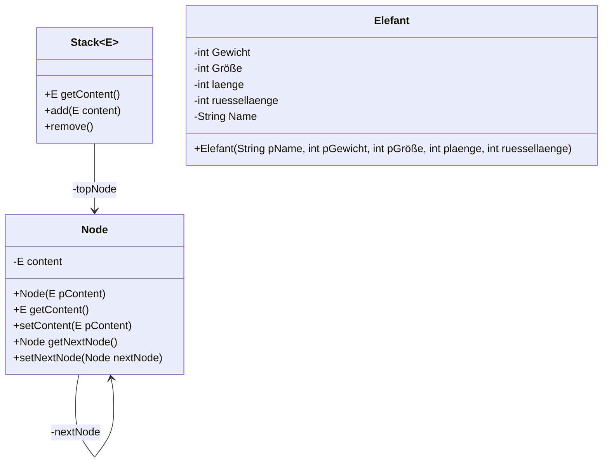

::::tabs

:::tab{title="Klassendiagramm ohne Knoten"}

:::

:::tab{title="Klassendiagramm mit Knoten"}

:::

:::tab{title="Quellcode ohne Knoten"}
```java
public class Stack {
  private Node topNode;

  public Node getTopNode() {
    return topNode;
  }

  public void add(Node newNode) {
    newNode.setNextNode(topNode);
    topNode = newNode;
  }

  public void remove() {
    topNode = topNode.getNextNode();
  }
}

public class Node {

  private Node nextNode;
  private final String id;

  public Node(String id) {
    this.id = id;
  }

  public Node getNextNode() {
    return nextNode;
  }

  public void setNextNode(Node nextNode) {
    this.nextNode = nextNode;
  }

  public String getId() {
    return id;
  }
}
``` 
:::
:::tab{title="Quellcode mit Knoten"}
```java

public class Stack<E> {
    private Node topNode;

    public E getContent() {
        if (topNode == null){
            return null;
        }
        return topNode.getContent();
    }

    public void add(E content) {
        Node newNode = new Node(content);
        newNode.setNextNode(topNode);
        topNode = newNode;
    }

    public void remove() {
        topNode = topNode.getNextNode();
    }

    public class Node {

        private Node nextNode;
        private E content;
        public Node( E pContent) {
            content = pContent;
        }

        public E getContent(){
            return content;
        }

        public void setContent(E pContent){
            content = pContent;
        }

        public Node getNextNode() {
            return nextNode;
        }

        public void setNextNode(Node nextNode) {
            this.nextNode = nextNode;
        }

    }
}

public class Elefant
{

    private int Gewicht;
    private int Groeße;
    private int laenge;
    private int ruessellaenge;
    private String Name;

    public Elefant(String pName, int pGewicht, int pGroeße,int pLaenge,int pRuessellaenge)
    {
        Name = pName;
        Gewicht=pGewicht;
        Groeße = pGroeße;
        laenge= pLaenge;
        ruessellaenge= pRuessellaenge;
    }

}
```
:::

::::

# Dokumentation der Modellierung
## ohne Knoten 

**Stack()**

Ein Objekt der Klasse Stack wird erzeugt.

**void add()**

Fügt eine Node zum Stack hinzu.

**void remove()**

Entfernt eine Node vom Stack.

**Node getTopNode()**

Gibt die erste Node zurück.

## mit Knoten 

**Stack()**

Ein Objekt der Klasse Stack wird erzeugt.

**void add()**

Fügt ein Element auf die oberste Stelle des Stacks hinzu.

**void remove()**

Entfernt das oberste Element vom Stack.

**Node getTopNode()**

Gibt das erste Element zurück.
 
**setContent()**

Erzeugt ein Element.

**getNextNode()**

Gibt das nächste Element zurück.

**setNextNode**

Setzt das nächste Element fest.


# Zentralbiturklasse Stack des Landes NRW
## Die generische Klasse Stack
Objekte der generischen Klasse Stack (Keller, Stapel) verwalten beliebige Objekte vom Typ ContentType nach dem Last-In-First-Out-Prinzip, d. h., das zuletzt abgelegte Objekt wird als erstes wieder entnommen. Alle Methoden haben eine konstante Laufzeit, unabhängig von der Anzahl der verwalteten Objekte.

### Dokumentation der Klasse Stack<ContentType>

**Stack()**
Ein leerer Stapel wird erzeugt. Objekte, die in diesem Stapel verwaltet werden, müssen vom Typ ContentType sein.

**boolean isEmpty()**
Die Anfrage liefert den Wert true, wenn der Stapel keine Objekte enthält, sonst liefert sie den Wert false.

**void push(ContentType pContent)**
Das Objekt pContent wird oben auf den Stapel gelegt. Falls pContent gleich null ist, bleibt der Stapel unverändert.

**void pop()**
Das zuletzt eingefügte Objekt wird von dem Stapel entfernt. Falls der Stapel leer ist, bleibt er unverändert.

**ContentType top()**
Die Anfrage liefert das oberste Stapelobjekt. Der Stapel bleibt unverändert. Falls der Stapel leer ist, wird null zurückgegeben.

