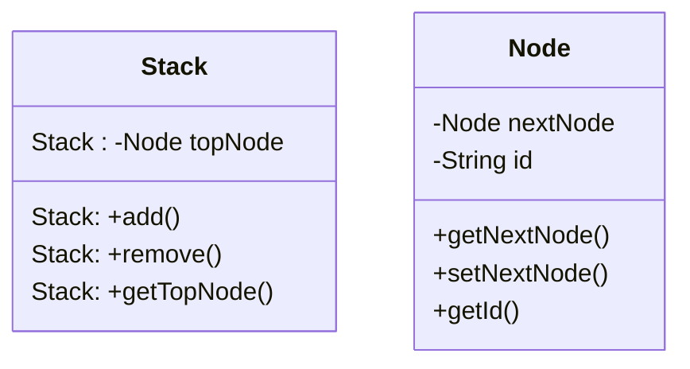

::::tabs{id="Stack"}
:::tab{title="Klassendiagramm" id="Klassendiagramm"}

:::

:::tab{title="Java" id="Java Quellcode"}
```java
public class Stack {
  private Node topNode;

  public Node getTopNode() {
    return topNode;
  }

  public void add(Node newNode) {
    newNode.setNextNode(topNode);
    topNode = newNode;
  }

  public void remove() {
    topNode = topNode.getNextNode();
  }
}

public class Node {

  private Node nextNode;
  private final String id;

  public Node(String id) {
    this.id = id;
  }

  public Node getNextNode() {
    return nextNode;
  }

  public void setNextNode(Node nextNode) {
    this.nextNode = nextNode;
  }

  public String getId() {
    return id;
  }
}
``` 
:::
::::

## Dokumentation der Modellierung
### Klasse Stack

**Caesar()**

Ein Objekt der Klasse Caesar wird erzeugt. Hierbei wird der Klartext und der Geheimtext mit keinem Wert initialisiert und der Wert für den Schlüssel auf 0 gesetzt.

**void verschluesseln()**

Der Klartext wird mit Hilfe des Schluessels nach der Caesarmethode verschluesselt. Sind weder Schluessel und/oder Klartext gesetzt wird das "leere" Wort mit einem Schlüsselwert von 0 verschluesselt. Beim Verschlüsseln werden nur Grossbuchstaben verschlüsslelt.

**void entschluesseln()**

Der verschlüsselte Text (Geheimtext) wird nach der Caesarmethode entschlusslet und speichert den entschlüssleten Text im Attribut für den Klartext (kt).


**char zahlenZuBuchstaben(int pWert)**

Die Anfrage liefert zu einem Zahlenwert den nach ASCII Tabelle passenden Buchstaben.

**int buchstabenZuZahlen(char pWert)**

Die Anfrage liefert zu einem Buchstaben den nach ASCII Tabelle passenden Zahlenwert.

**String getGt()**

Die Anfrage gibt den verschlüssleten Text (Geheimtext) wieder (Wert des Attributs gt).

**void setGt(String pGt)**

Setze Methode für den Geheimtext auf den Wert des Parameters pGt.

**String getKt()**

Die Anfrage gibt den unverschlüssleten Text (Klartext) wieder (Wert des Attributs kt).

**void setKt(String pKt)**

Setze Methode für den Klartext auf den Wert des Parameters pKt.

**int getSchluessel()**

Die Anfrage gibt den des Schlüssels wieder (Wert des Attributs schluessel).

**void setSchluessel(int pSchluessel)**

Setze Methode für den Schlüssel auf den Wert des Parameters pSchluessel.
